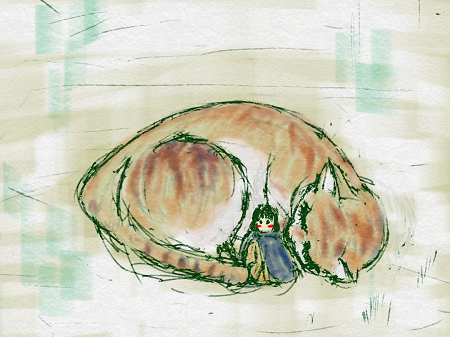
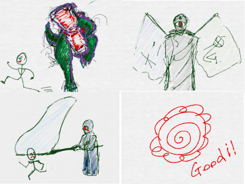
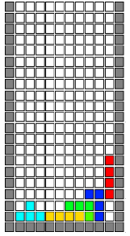
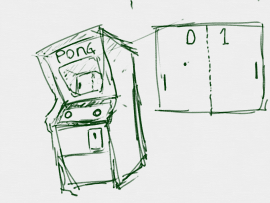
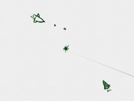
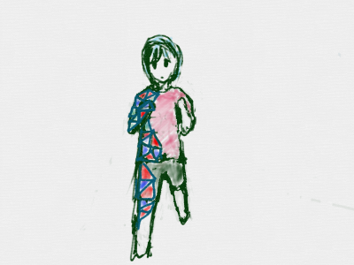
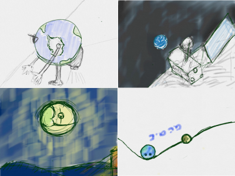
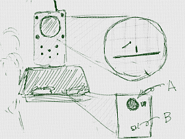
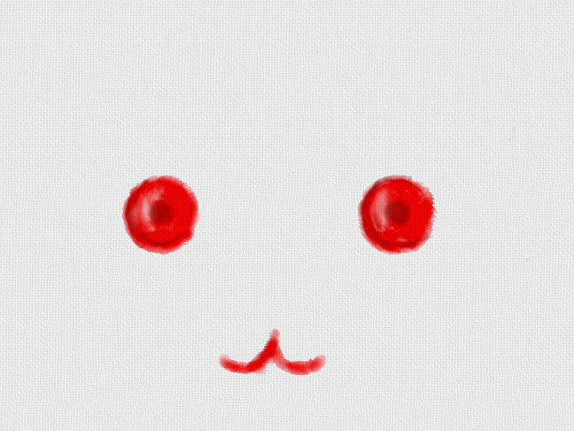

# <ruby>火<rt>ひ</rt></ruby>の<ruby>型<rt>かた</rt></ruby>で、プログラマーになろう</ruby>

 

<ruby>今<rt>いま</rt></ruby>、あなたは、<ruby>世界一<rt>せかいいち</rt>のプログラマーになりました。

ソフトウェアが<ruby>動作<rt>どうさ</rt></ruby>する<ruby>環境<rt>かんきょう</rt></ruby>なら
あなたに<ruby>不可能<rt>ふかのう</rt></ruby>な<ruby>事<rt>こと</rt></ruby>はありません。

もうすぐ、あらゆるもので、ソフトウェアが<ruby>動作<rt>どうさ</rt></ruby>するようになります。

つまり、あなたは　あらゆることができます。
もう、なんでもありです。

<ruby>何<rt>なに</rt></ruby>を<ruby>作<rt>つく</rt></ruby>ってみたいですか?

　
## <ruby>火<rt>ひ</rt></ruby>の<ruby>型<rt>かた</rt></ruby>を<ruby>試<rt>ため</rt></ruby>すと、<ruby>色々<rt>いろいろ</rt></ruby>なゲームを<ruby>作<rt>つく</rt></ruby>れるようにります。

  25<ruby>回<rt>かい</rt></ruby>にわたって
  ScratchとDartを<ruby>利用<rt>りよう<rt></ruby>して、ミニゲームを<ruby>作成<rt>さくせい</rt></ruby>していきます。

  ひとつの<ruby>記事<rt>きじ</rt></ruby>が1<ruby>時間<rt>じかん</rt></ruby>くらいのチュートリアルです。

  いろんなゲームを<ruby>作<rt>つく</rt></ruby>れるようになります

### A. おにごっこゲームを<ruby>作成<rt>さくせい<rt></ruby>したり
https://scratch.mit.edu/projects/87798109

### B. スプラトゥーンっぽいゲームを<ruby>作<rt>つく</rt></ruby>ったり

https://scratch.mit.edu/projects/78792936/

### C. テトリスを<ruby>作<rt>つく</rt></ruby>ったり
https://scratch.mit.edu/projects/84309456/

### D. パズドラっぽいのを<ruby>作<rt>つく</rt></ruby>ったり

https://scratch.mit.edu/projects/89631068/

### E. Pongを<ruby>作<rt>つく</rt></ruby>ったり

https://scratch.mit.edu/projects/77999912/

### F. Spacewar!!を<ruby>作<rt>つく</rt></ruby>ったり

https://scratch.mit.edu/projects/78173242/

### G. 3Dアニメを<ruby>作<rt>つく</rt></ruby>ったり

https://scratch.mit.edu/projects/88155875/

### H. <ruby>重力<rt>じゅうりょく</rt></ruby><ruby>計算<rt>けいさん</rt></ruby>をして、<ruby>星<rt>ほし</rt></ruby>の<ruby>運行<rt>うんこう</rt></ruby>を<ruby>予想<rt>よそう</rt></ruby>したり

https://scratch.mit.edu/projects/84535698/

### I. Tennis For Two を<ruby>作<rt>つく</rt></ruby>ったり

https://scratch.mit.edu/projects/77983448/

　
　
　　
　　

　
　　
　　

## <ruby>火<rt>ひ</rt></ruby>の<ruby>型<rt>かた</rt></ruby>を<ruby>試<rt>ため</rt></ruby>すと、<ruby>色々<rt>いろいろ</rt></ruby>な<ruby>誤解<rt>ごかい</rt></ruby>が<ruby>解<rt>と</rt></ruby>けます

### プログラムは<ruby>難<rt>むずか</rt></ruby>しいという<ruby>誤解<rt>ごかい</rt></ruby>

このようなプログラムは、<ruby>複雑<rt>ふくざつ</rt><ruby>で、<ruby>特別<rt>とくべつ</rt></ruby>な<ruby>教育<rt>きょういく</rt></ruby>を<ruby受<rt>う</rt></ruby>けた<ruby>人<rt>ひと</rt></ruby>が<ruby>書<rt>か</rt></ruby>くものと<ruby>考<rt>かんが</rt></ruby>えていませんか?

#### <ruby>人間<rt>にんげん</rt></ruby>の<ruby>言葉<rt>ことば</rt></ruby>のほうが<ruby>複雑<rt>ふくざつ</rt></ruby>

プログラム<ruby>言語<rt>げんご</rt></ruby>は、<ruby>人工言語<rt>じんこうげんご</rt></ruby>です。
<ruby>英語<rt>えいご</rt></ruby>、<ruby>日本語<rt>にほんご</rt></ruby>、ドイツ<ruby>語<rt>ご</rt></ruby>、と、<ruby>我々<rt>われわれ</rt></ruby>、<ruby>人族<rt>ひとぞく</rt></ruby>が<ruby>使<rt>つか</rt></ruby>う<ruby>言語<rt>げんご</rt></ruby>を<ruby>基本<rt>きほん</rt></ruby>に<ruby>作成<rt>さくせい</rt></ruby>されました。

しかも、<ruby>人族<rt>ひとぞく</rt></ruby>の<ruby>言語<rt><げんご/rt></ruby>を<ruby>学<rt>まな</rt></ruby>ぶのとは<ruby>違<rt>ちが</rt></ruby>い、<ruby>覚<rt>おぼ</rt></ruby>える<ruby>事<rt>こと</rt></ruby>はとても<ruby>少<rt>すく</rt></ruby>なく。
<ruby>語学学習<rt><ごがくがくしゅう/rt></ruby>としての<ruby>難易度<rt>なんいど</rt></ruby>は<ruby>低<rt>ひく</rt></ruby>いです。

<ruby>頑張<rt>がんば</rt></ruby>れば、1～2<ruby>週間<rt>しゅうかん</rt></ruby>とかからず<ruby>習得<rt>しゅうとく</rt></ruby>できます。

#### <ruby>粘土<rt>ねんど</rt></ruby>をこねるようなもの

<ruby>何<rt>なに</rt></ruby>か<ruby>作<rt>つく</rt></ruby>りたゲームがあったとして、どこから<ruby>手<rt>て</rt></ruby>をつけて<ruby>良<rt>よ</rt></ruby>いかわからない<ruby>君</ruby>!!

<ruby>一見<rt>いっけん</rt></ruby>して、<ruby>複雑<rt>ふくざつ</rt></ruby>な<ruby>構造<rt>こうぞう</rt></ruby>も、<ruby>単純<rt>たんじゅん</rt></ruby>な<ruby>仕組<rt>しく</rt></ruby>みの<ruby>組<rt>く</rt></ruby>み<ruby>合<rt>あ</rt></ruby>わせからできています。すぐに、<ruby>作<rt>つく</rt></ruby>れるところから、<ruby>少<rt>すこ</rt></ruby>しずつ<ruby>組<rt>く</rt></ruby>み<ruby>立<rt>た</rt></ruby>てていきましょう。

もちろん、<ruby>効率的<rt>こうりつてき</rt></ruby>に<ruby>組<rt>く</rt></ruby>むためのテクニックはありますが、<ruby>直<rt>す</rt></ruby>ぐに<ruby>組<rt>く</rt></ruby>み<ruby>立<rt>た</rt></ruby>てられるところから、<ruby>組<rt>く<rt></ruby>み<ruby>立<rt>た</rt></ruby>てていくだけでもゲームは<ruby>完成<rt>かんせい</rt></ruby>します。

　
## <ruby>火<rt>ひ</rt></ruby>の<ruby>型<rt>かた</rt></ruby>がサポートします。

<ruby>僕<rt>ぼく</rt></ruby>と<ruby>契約<rt>けいやく</rt></ruby>して、プログラマーになってよ!!

　 
　<ruby>興味<rt>きょうみ</rt></ruby>が<ruby>沸<rt>わ</rt></ruby>いてきましたか? そんな、そこのあなた!! <ruby>実際<rt>じっさい</rt></ruby>に<ruby>手<rt>て</rt></ruby>を<ruby>動<rt>うご</rt></ruby>かすのが<ruby>早道<rt>はやみち</rt></ruby>です。<ruby>火<rt>ひ</rt></ruby>の<ruby>型<rt>かた</rt></ruby>では、<ruby>粘土<rt>ねんど</rt></ruby>をこねるようにゲームを<ruby>作成<rt>さくせい</rt></ruby>していきます。
<ruby>一緒<rt>いっしょ</rt></ruby>にTry&Errorを<ruby>繰<rt>く</rt></ruby>り<ruby>返<rt>かえ</rt></ruby>しましょう!!

## Thanks

ここまで、<ruby>読<rt>よ</rt></ruby>んでくれてありがとう!!

では、<ruby>次回<rt>じかい</rt><ruby><ruby>会<rt>あ</rt></ruby>えることを、<ruby>楽<rt>たの</rt></ruby>しみにしています。

ではでは

> 今、あなたは、世界一のプログラマーになりました。
> ソフトウェアが動作する環境なら
> あなたに不可能はないでしょう。
>
> もうすぐ、あらゆるもので、ソフトウェアが動作するようになります。
> つまり、あなたは　あらゆることができます。
> もう、なんでもありです。
>
> 何を作ってみたいですか?
>
