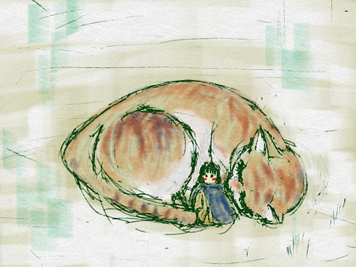

<ruby>今<rt>いま</rt></ruby>、あなたは、<ruby>世界一<rt>せかいいち</rt>のプログラマーになりました。

ソフトウェアが<ruby>動作<rt>どうさ</rt></ruby>する<ruby>環境<rt>かんきょう</rt></ruby>なら
あなたに<ruby>不可能<rt>ふかのう</rt></ruby>な<ruby>事<rt>こと</rt></ruby>はありません。

もうすぐ、あらゆるもので、ソフトウェアが<ruby>動作<rt>どうさ</rt></ruby>するようになります。

つまり、あなたは　あらゆることができます。
もう、なんでもありです。

この世の中に、大切な人に
<ruby>何<rt>なに</rt></ruby>を<ruby>提供<rt>ていきょう</rt></ruby>してみたいですか?

## <ruby>実際<rt>じっさい</rt></ruby>に<ruby>利用<rt>りよう</rt></ruby>されているプログラム<ruby>言語<rt>げんご</rt></ruby>を<ruby>利用<rt>りよう</rt></ruby>してみよう!!

<ruby>学習用<rt>がくしゅうよう</rt></ruby>ではなくて、<ruby>実際<rt>じっさい</rt></ruby>に<ruby>利用<rt>りよう</rt></ruby>されているプログラム<ruby>言語<rt>げんご</rt></ruby>を<ruby>利用<rt>りよう</rt></ruby>してみよう!!

<ruby>身<rt>み</rt></ruby>の<ruby>回<rt>まわ</rt></ruby>りには、プログラムが<ruby>動作<rt>どうさ</rt></ruby>している<ruby>端末<rt>たんまつ</rt></ruby>が沢山あります。

* TV
* PC
* インターネット
* Googleのサービス
* レジ
* 電子レンジ
* 洗濯機
* 携帯電話

そういった<ruby>物<rt>もの<rt></ruby>を<ruby>動<rt>うご</rt></ruby>かすプログラムを<ruby>書<rt>か</rt></ruby>く<ruby>事<rt>こと</rt></ruby>ができるようになります。

つまり、プログラムを<ruby>覚<rt>おぼ</rt></ruby>えたあなたも
<ruby>同<rt>おな</rt></ruby>じ<ruby>事<rt>こと</rt></ruby>ができるようになります。

<ruby>身<rt>み</rt></ruby>の<ruby>回<rt>まわ</rt></ruby>りの<ruby>物<rt>もの</rt></ruby>を<ruby>電子化<rt>でんしか</rt></ruby>したりするのはどうですか?

お<ruby>人形<rt>にんぎょう</rt></ruby>やプラモデルを、ゲームのコントローラーで<ruby>操作<rt>そうさ</rt></ruby>できるようにしたりとか。

もちろん、Googleのようなサービスを<ruby>作<rt>つく</rt></ruby>ることも<ruby>可能<rt>かのう</rt></ruby>ですよ!!

　　

## Dartはいかがですか
　Kyorohiroが<ruby>好<rt>す</rt></ruby>きな<ruby>言語<rt>げんご</rt></ruby>です。 ブラウザーアプリ、Androidアプリ、iOSアプリ、サーバーサイド から <ruby>一部<rt>いちぶ</rt></ruby><ruby>組<rt>く</rt></ruby>み<ruby>込<rt>こ</rt></ruby>みまで、<ruby>利用可能<rt>りようかのう</rt></ruby>な<ruby>言語<rt>げんご</rt></ruby>です。

　オブジェクト<ruby>指向<rt>しこう</rt></ruby>をサポートしつつ、<ruby>単一<rt>たんいつ</rt></ruby>スレッド<ruby>上<rt>じょう</rt></ruby>で<ruby>動作<rt>どうさ</rt></ruby>するプログラムを<ruby>書<rt>か</rt></ruby>くことができる、<ruby>凄<rt>すご</rt></ruby>い<ruby>子<rt>こ</rt></ruby>です。

　
## <ruby>開発環境<rt>かいはつかんきょう</rt></ruby>をインストールしてみよう

<ruby>開発環境<rt>かいはつかんきょう</rt></ruby>として IntelliJ を <ruby>利用<rt>りよう</rt></ruby>してみましょう。
https://www.dartlang.org/tools/jetbrains-plugin

### IntelliJをダウンロード
1. IntelliJをダウンロードするサイトに<ruby>行<rt>い</rt></ruby>く
https://www.jetbrains.com/idea/download/

2. <ruby>自分<rt>じふん</rt></ruby>が<ruby>利用<rt>りよう</rt></ruby>しているOSを<ruby>選<rt>えら</rt></ruby>んでCommunity のダウンロードをクリック
  

3. ダウンロードを<ruby>開始<rt>かいし</rt></ruby>します。
  
  もしも、ダウンロードが<ruby>開始<rt>かいし</rt></ruby>され<ruby>無<rt>な</rt></ruby>い<ruby>場合<rt>ばあい</rt></ruby>は、「direct link」をクリックしてください  

### インストール
ダウンロードしたファイルをクリックしてみましょう。
ここからの<ruby>操作<rt>そうさ</rt></ruby>は<ruby>環境<rt>かんきょう</rt></ruby>によって<ruby>変<rt>か</rt></ruby>わります。

<ruby>参考程度<rt>さんこうていど</rt></ruby>に

1. Nextをクリック  
  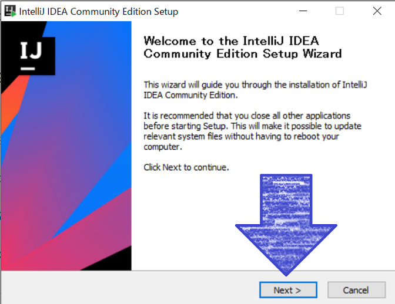
2. Nextをクリック  
  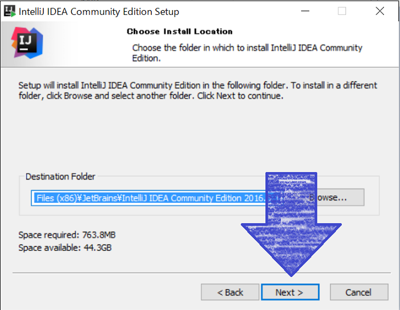
3. shortcut<ruby>作成<rt>さくせい</rt></ruby>にチェックを入れて、Nextをクリック  
  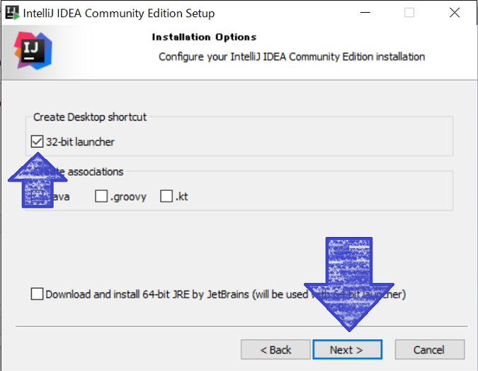
4. Installをクリック
  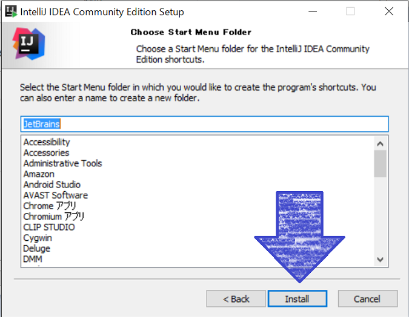
5. <ruby>少<rt>すこ</rt></ruby>し<ruby>待<rt>ま</rt></ruby>つ  
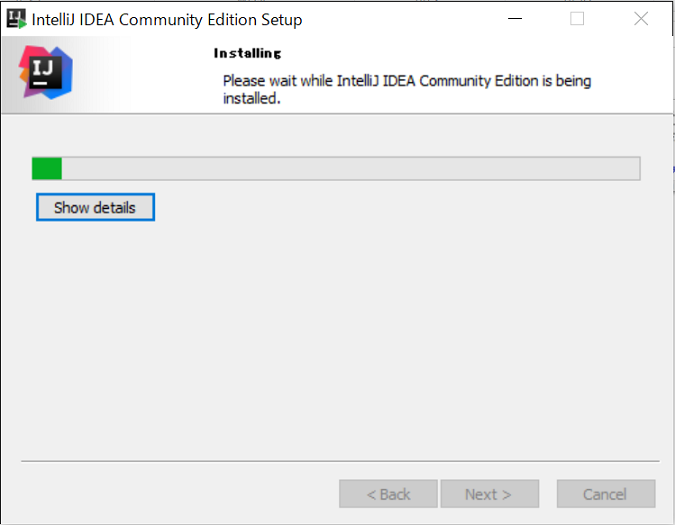
6. Finishボタンを<ruby>押<rt>お</rt></ruby>して<ruby>完了<rt>かんりょう</rt></ruby>です  
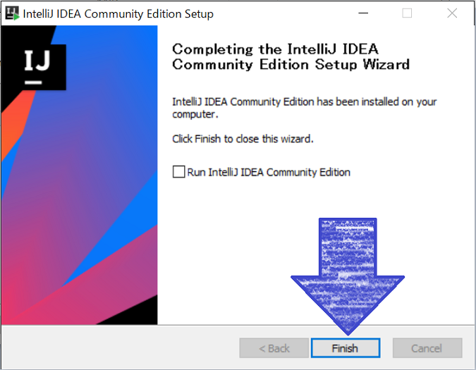

## Dartをダウンロート
https://www.dartlang.org/install に<ruby>従<rt>した</rt></ruby>ってインストールしてください。

### <ruby>私<rt>わたし</rt></ruby>は<ruby>以下<rt>いか</rt></ruby>の<ruby>手順<rt>てじゅん</rt></ruby>でやりました
1. https://www.dartlang.org/install/archive を開く
2. Dart SDK と Dartium をダウンロード  
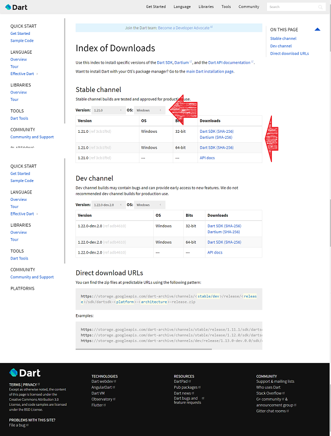
※ OSのバージョンの<ruby>調<rt>方しら</rt></ruby>べた<ruby>方<rt>かた</rt></ruby>とかは、Googleで<ruby>検索<rt>けんさく</rt></ruby>してみよう
3. ダウンロードしたZIPファイルを<ruby>解凍<rt>かいとう</rt></rubyして、<ruby>以下<rt>いか</rt></ruby>におく
  * c:\tools\dart-sdk
  * c:\tools\dartium1.21  
  ※ <ruby>置<rt>お</rt></ruby>き<ruby>場所<rt>ばしょ</rt></ruby>はどこでも<ruby>良<rt>よ</rt></ruby>いです。お<ruby>好<rt>す</rt></ruby>きなところで  
  ※ <ruby>解凍方法<rt>かいとうほうほう</rt></ruby>は、Googleで<ruby>検索<rt>けんさく</rt></ruby>してみよう

## IntelliJを<ruby>起動<rt>きどう</rt></ruby>して<ruby>設定<rt>せってい</rt></ruby>する

1. Skip All abd Defaults をクリック  
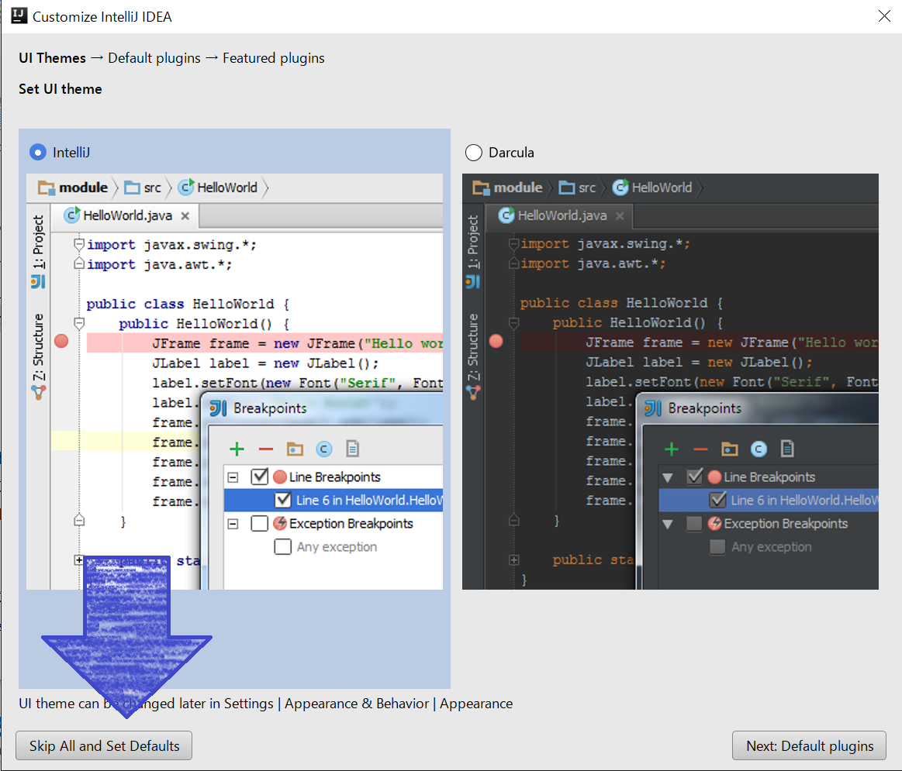  
2. Configure->Plugins を選択
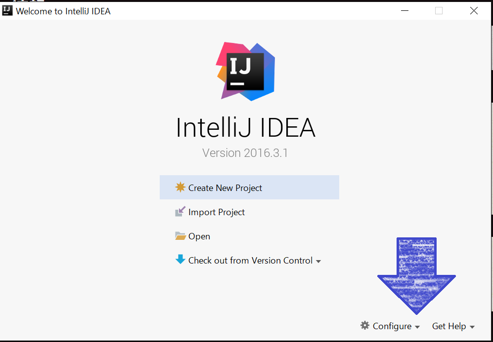
3. Install JetBrains Plugin をクリック  
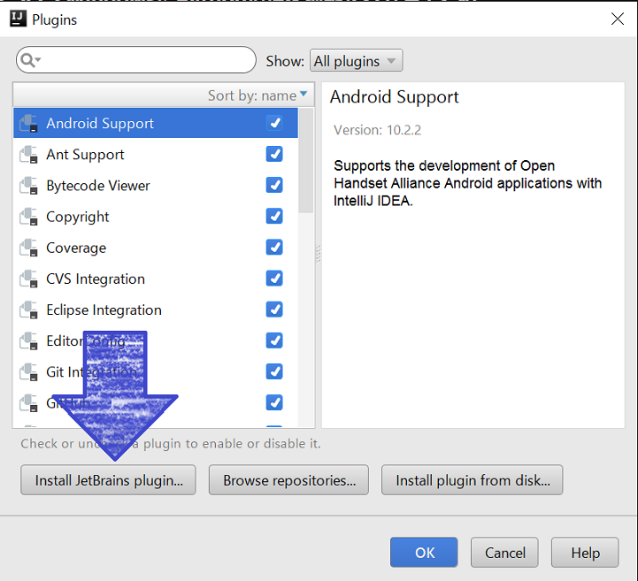
4. Dartを選択して、Installをクリック  
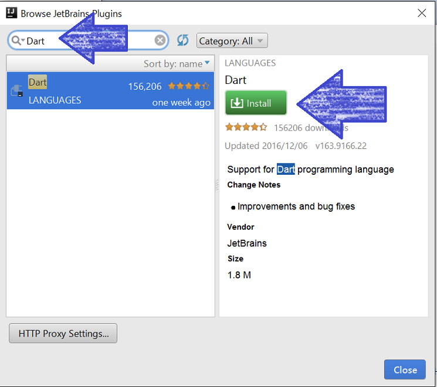
5. Restart IntelliJ IDEA をクリック    
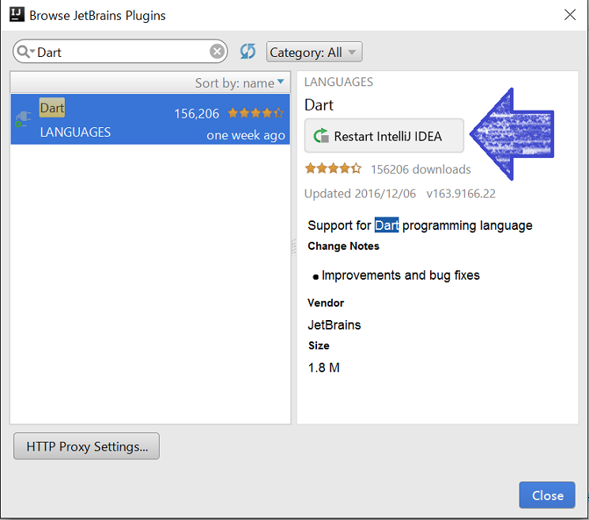

## Dart SDK と Dartium の<ruby>設定<rt>せってい</rt></ruby>をする
1. Create New Project をクリック  
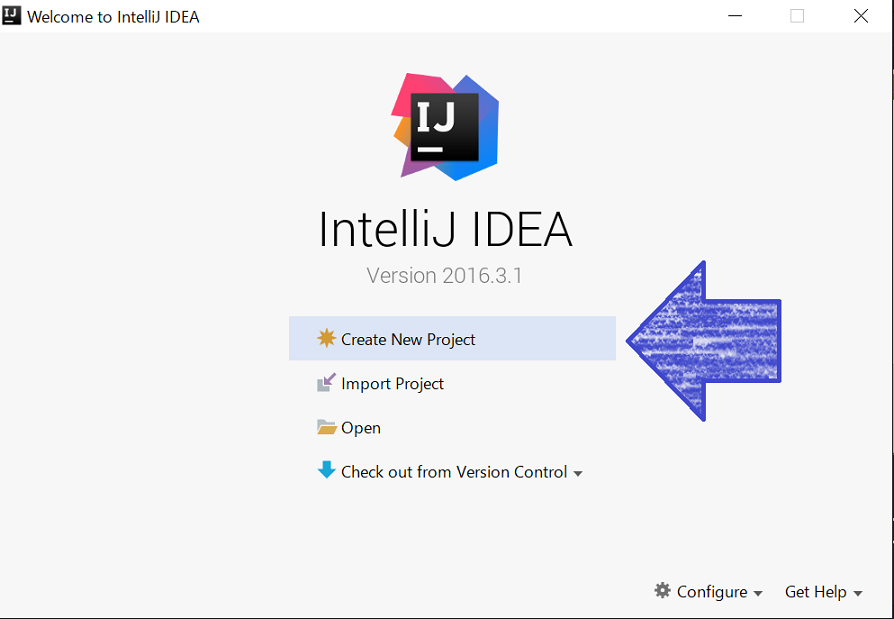
2. Dartを<ruby>クリック</ruby>して、pathを<ruby>設定<rt>せってい</rt></ruby>する  
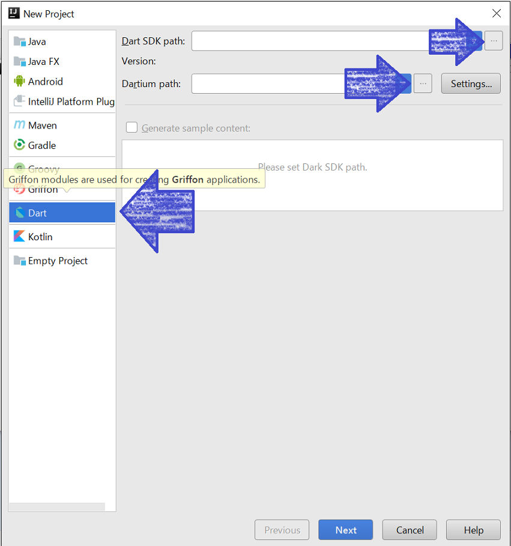  
<ruby>私<rt>わたし</rt></ruby>の<ruby>場合<rt>ばしょ</rt></ruby>は、Dart Sdk には「c:/tools/dart-sdk/」を<ruby>指定<rt>してい</rt></ruby>しました。 Dartiumは、「c:/tools/dartium/chrome.exe」を<ruby>指定<rt>してい</rt></ruby>しました。  
※ Dartを<ruby>解凍<rt>かいとう</rt></ruby>した<ruby>場所<rt>ばしょ</rt></ruby>によって<ruby>変<rt>か</rt></ruby>わります!!  
3. Nextボタンを<ruby>押<rt>お</rt</ruby>す

　　
　
## HelloWorldを<ruby>実行<rt>じっこう</rt></ruby>してみる
1. Dartを選択して、 Simple Console...を選択する。  
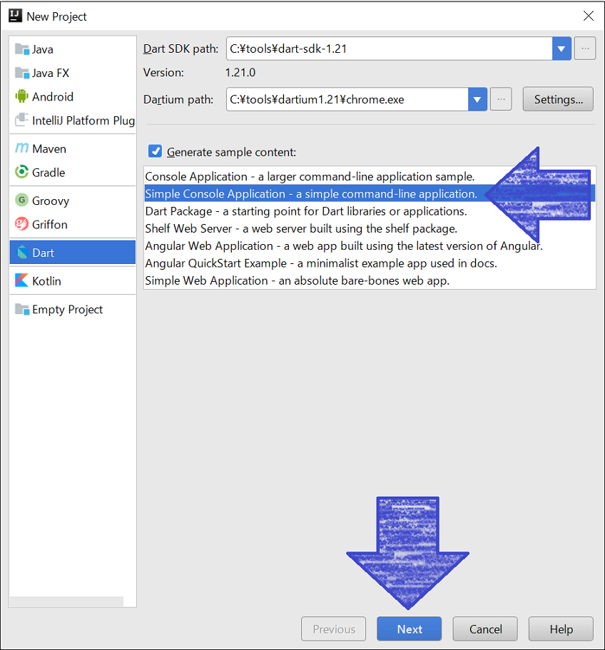  
2. Nextボタンをクリック  
3. Project name　を　helloworld にする  
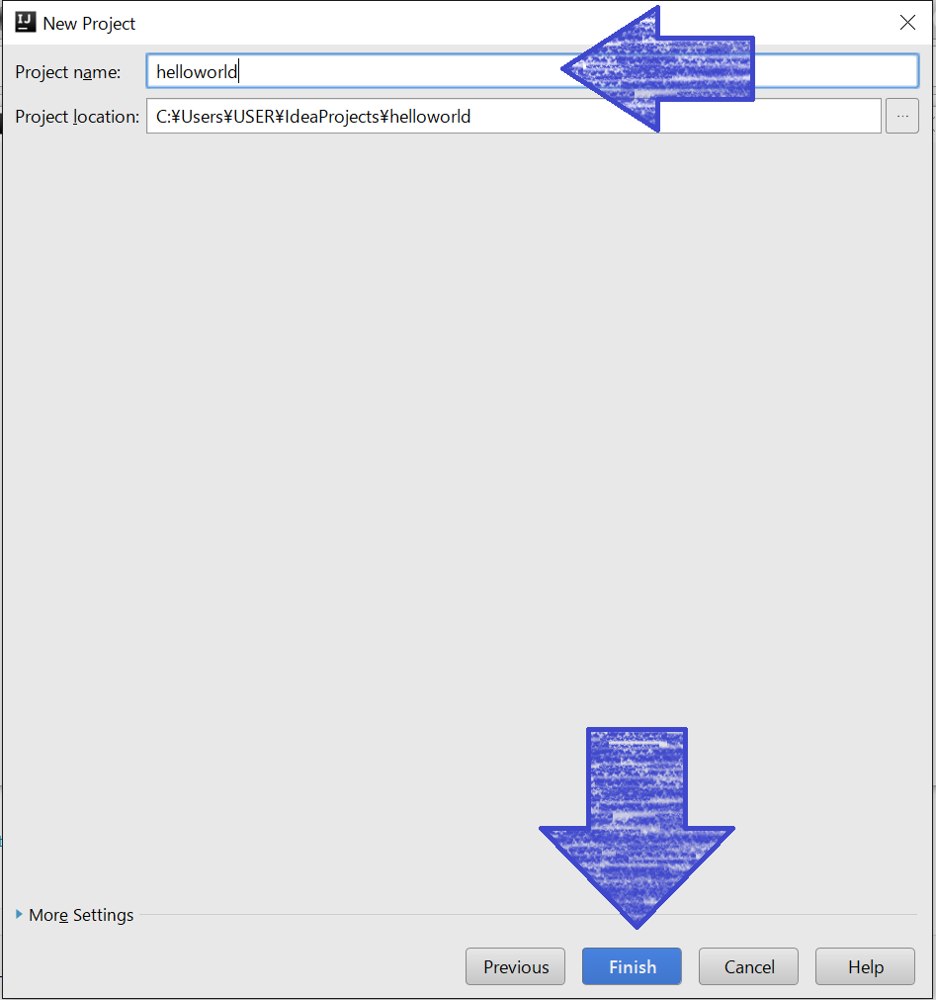
4.  Finbish ボタンをクリック  
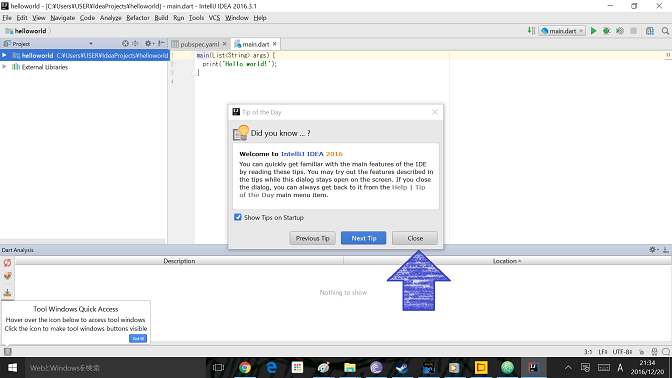
5. Closeボタンをクリック

6. Runボタンをクリック  
  
7. hello world!! と表示されます。

## Thanks

ここまで、<ruby>読<rt>よ</rt></ruby>んでくれてありがとう!!

では、<ruby>次回<rt>じかい</rt><ruby>、また
<ruby>会<rt>あ</rt></ruby>えることを、
<ruby>楽<rt>たの</rt></ruby>しみにしています。

　　

ではでは

