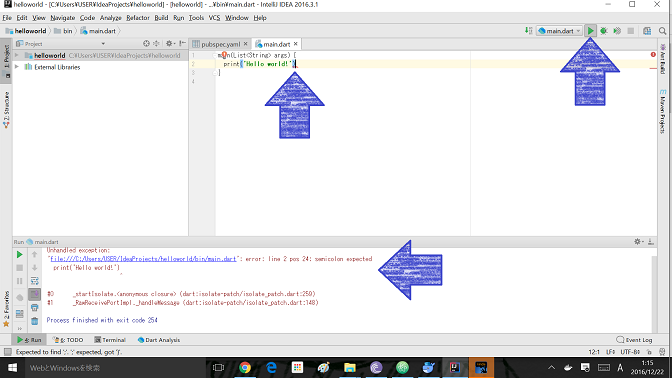
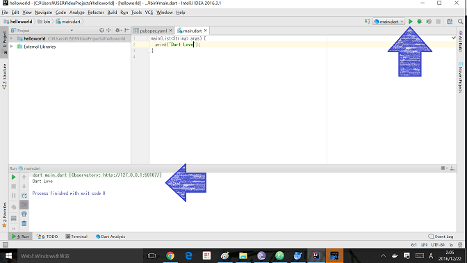

## おかしなコードを<ruby>書<rt>か</rt></ruby>いてみよう
<ruby>前回<rt>ぜんかい</rt></ruby>、<ruby>実行<rt>じっこう</rt></ruby>した HelloWorld の コード を、いじってみよう
```
main(List<String> args) {
  print('Hello world!');
}
```

な、コードでしたね

### ";" を<ruby>削除<rt>さくじょ</rt></ruby>してみる。
1. コードを<ruby>変更<rt>へんこう</rt></ruby>する
```
main(List<String> args) {
  print('Hello world!')
}
```
2. <ruby>実行<rt>じっこう</rt></ruby>する  

3. Errorが<ruby>出力<rt>しゅつりょく</rt></ruby>されます  
```
Unhandled exception:
'helloworld/bin/main.dart': error: line 2 pos 24: semicolon expected
  print('Hello world!')
```
2<ruby>行目<rt>ぎょうめ</rt></ruby>にセミコロン(;)を<ruby>追加<rt>ついか</rt></ruby>してください。と<ruby>指示<rt>しじ</rt></ruby>がでます。


このように、Scratchの<ruby>時<rt>とき</rt></ruby>と<ruby>違<rt>ちが</rt></ruby>って、Charベースのプログラムは<ruby>書<rt>か</rt></ruby>き<ruby>間違<rt>まちが</rt></ruby>えると、<ruby>動作<rt>どうさ</rt></ruby>してくれません。


## <ruby>出力<rt>しゅつりょく</rt></ruby>する<ruby>文字<rt>もじ</rt></ruby>を<ruby>変<rt>か</rt></ruby>えてみる
1. コードを<ruby>変更<rt>へんこう</rt></ruby>する  
```
main(List<String> args) {
  print('Dart Love');
}
```
2. <ruby>実行<rt>じっこう</rt></ruby>する  
  
Dart Love と<ruby>表示<rt>ひょうじ</rt></ruby>されます


## Thanks

ここまで、<ruby>読<rt>よ</rt></ruby>んでくれてありがとう!!

では、<ruby>次回<rt>じかい</rt><ruby><ruby>会<rt>あ</rt></ruby>えることを、<ruby>楽<rt>たの</rt></ruby>しみにしています。

ではでは
