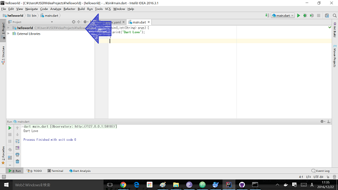
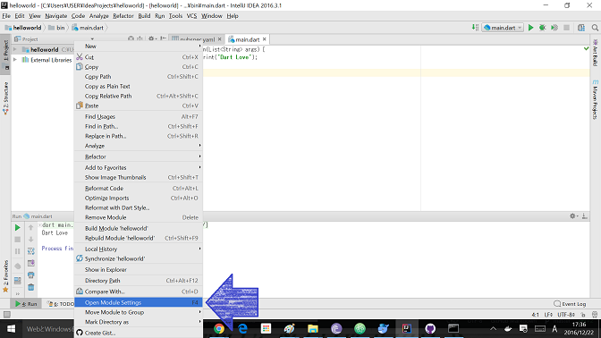
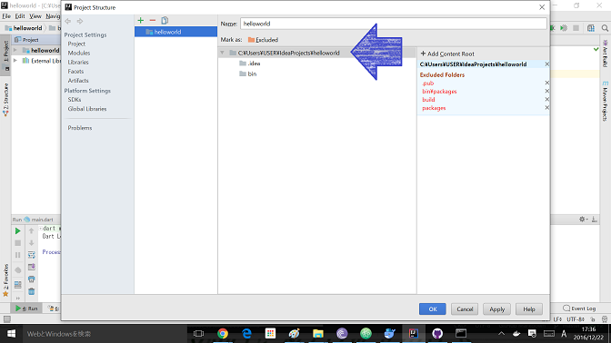
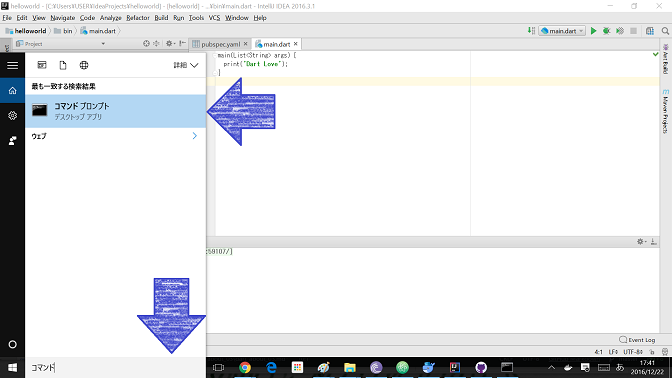
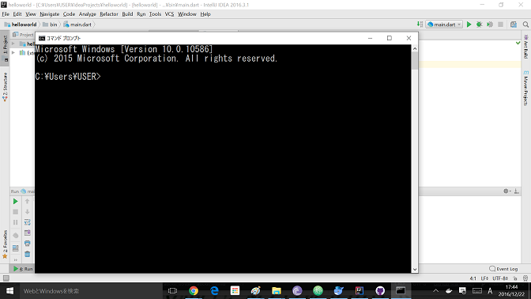

# コマンドラインから<ruby>実行<rt>じっこう</rt></ruby>してみよう

<ruby>今<rt>いま</rt></ruby>、<ruby>作成<rt>さくせい</rt></ruby>しているのはコマンドラインアプリです。

コマンドプロンプトから<ruby>実行<rt>じっこう</rt></ruby>できます。

<ruby>試<rt>ため</rt></ruby>してみよう


　　
### プロジェクトフォルダーの<ruby>場所<rt>ばしょ</rt></ruby>を<ruby>調<rt>しら</rt></ruby>べる

1. プロジェクトにカーソルを<ruby>合<rt>あ</rt></ruby>わせて、<ruby>右<rt>みぎ</rt></ruby>クリックする。  
     
2. Open Module Settings をクリック  

3. プロジェクトフォルダーのパスが<ruby>表示<rt>ひょうじ</rt></ruby>されます


### コマンドプロンプトを<ruby>開<rt>ひら</rt></ruby>く(Windows10の場合)
1. コマンドで検索する  

2. コマンドプロンプトをクリック  


### プログラムを<ruby>実行<rt>じっこう</rt></ruby>する
1. プロジェクトフォルダー<ruby>配下<rt>はいか</rt></ruby>に<ruby>移動<rt>いどう</rt></ruby>する  
```
cd C:\Users\USER\IdeaProjects\helloworld
```
2. <ruby>実行<rt>じっこう</rt></ruby>してみる  
```
c:\tools\dart-sdk-1.21\bin\dart.exe .\bin\main.dart
```  
Dart Love と<ruby>表示<rt>ひょうじ</rt></ruby>されました。


## Thanks

ここまで、<ruby>読<rt>よ</rt></ruby>んでくれてありがとう!!

では、<ruby>次回<rt>じかい</rt><ruby><ruby>会<rt>あ</rt></ruby>えることを、<ruby>楽<rt>たの</rt></ruby>しみにしています。

ではでは
