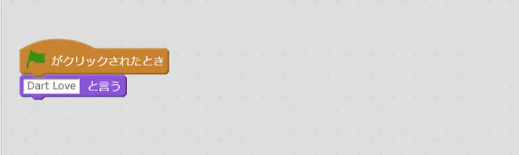

# Scratchと<ruby>比較<rt>ひかく</rt></ruby>してみよう

```
main(List<String> args) {
  print('Dart Love');
}
```

を、Scratchと<ruby>比較<rt>ひかく</rt></ruby>してみましょう。



- 「<ruby>旗<rt>はた</rt></ruby>がクリックされたとき」と main(List<String> args) {} は<ruby>同<rt>おな</rt></ruby>じよなもの  
  アプリの<ruby>起動時<rt>きどうじ</rt></ruby>に<ruby>呼<rt>よ</rt></ruby>ばれます。
- 「xxxと<ruby>言<rt>い</rt></ruby>う」とprint('xxx'); は<ruby>似<rt>に</rt></ruby>たようなもの  
  <ruby>文字<rt>もじ</rt></ruby>を<ruby>表示<rt>ひょうじ</rt></ruby>します。

# argsとは<ruby>何<rt>なに</rt></ruby>でしょうか?
Dartでは、アプリ<ruby>起動時<rt>きどうじ</rt></ruby>に<ruby>文字列<rt>もじれつ</rt></ruby>を<ruby>渡<rt>わた</rt></ruby>す<ruby>事<rt>こと</rt></ruby>ができます。
コードを<ruby>書<rt>か</rt></ruby>いて、<ruby>試<rt>ため</rt></ruby>してみましょう。

#### 1. <ruby>以下<rt>いじょう</rt></ruby>のようなコードを<ruby>書<rt>か</rt></ruby>く

```
main(List<String> args) {
  print('Dart Love ${args}');
}
```

#### 2. コマンドラインから<ruby>実行<rt>じっこう</rt></ruby>してみよう!!
```
c:\tools\dart-sdk-1.21\bin\dart.exe .\bin\main.dart test01 test02
```  

Dart Love [test01,test02]
と<ruby>表示<rt>ひょうじ</rt></ruby>されましたね!!


## Thanks

ここまで、<ruby>読<rt>よ</rt></ruby>んでくれてありがとう!!

では、<ruby>次回<rt>じかい</rt><ruby><ruby>会<rt>あ</rt></ruby>えることを、<ruby>楽<rt>たの</rt></ruby>しみにしています。

ではでは
