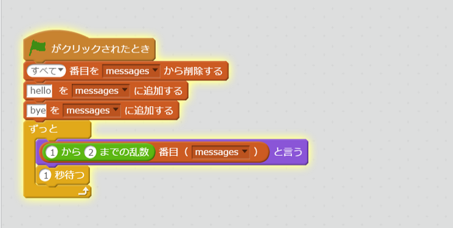

# Sleep<ruby>機能<rt>きのう</rt></ruby>を<ruby>利用<rt>りよう</rt></ruby>してみよう

<ruby>前回<rt>ぜんかい</rt></ruby>の<ruby>方法<rt>ほうほう</rt></ruby>だと、メッセージが<ruby>凄<rt>すご</rt></ruby>い<ruby>勢<rt>いきお</rt></ruby>いで<ruby>流<rt>なが</rt></ruby>れていくので、<ruby>間<rt>あいだ</rt></ruby>にSleepを<ruby>入<rt>い</rt></ruby>れてみましょう。



を、Dartで<ruby>書<rt>か</rt></ruby>いてみましょう。

```
import 'dart:math' as math;
import 'dart:async';

main(List<String> args) async {
  var rand = new math.Random();
  var messages = ["hello", "bye"];
  while(true) {
    print("${messages[rand.nextInt(2)]}");
    await new Future.delayed(new Duration(seconds: 1));
  }
}
```

## Sleep<ruby>機能<rt>きのう</rt></ruby>を<ruby>利用<rt>りよう</rt></ruby>するには、dart:async パッケージを<ruby>利用<rt>りよう<rt></ruby>します。
#### パッケージを<ruby>宣言<rt>せんげん</rt></ruby>する
```
import 'dart:async';
```

#### main<ruby>関数<rt>かんすう</rt></ruby>にasyncを<ruby>定義<rt>ていぎ</rt></ruby>する
```
main(List<String> args) async {
}
```

#### 1<ruby>秒<rt>びょう</rt></ruby>sleepするコードを<ruby>書<rt>か</rt></ruyb>く
```
  await new Future.delayed(new Duration(seconds: 1));
```

awaitを<ruby>宣言<rt>せんげん</rt></ruby>する<ruby>事<rt>こと</rt></ruby>で、1<ruby>秒<rt>びょう</rt></ruby>その<ruby>場<rt>ば</rt></ruby>で<ruby>待<rt>ま</rt></ruby>てるようになります。

awaitを<ruby>利用<rt>りよう</rt></ruby>したい<ruby>場合<rt>ばあい</rt></ruby>は、<ruby>関数<rt>かんすう</rt></ruby>にasync<ruby>宣言<rt>せんげん</rt></ruby>をする<ruby>必要<rt>ひつよう</rt></ruby>があります。


## Thanks

ここまで、<ruby>読<rt>よ</rt></ruby>んでくれてありがとう!!

では、<ruby>次回<rt>じかい</rt><ruby><ruby>会<rt>あ</rt></ruby>えることを、<ruby>楽<rt>たの</rt></ruby>しみにしています。

ではでは
