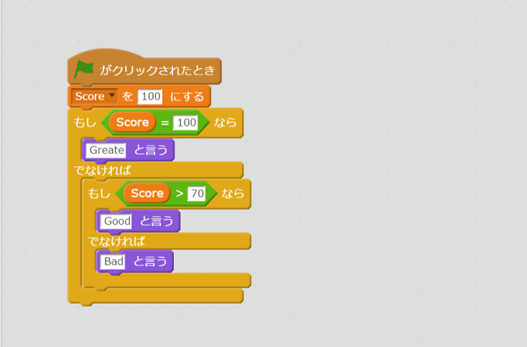

# If<ruby>文<rt>ぶん</rt></ruby>を<ruby>試<rt>ため</rt></ruby>してみよう

DartのIf<ruby>文<rt>ぶん</rt></ruby>を<ruby>見<rt>み</rt></ruby>ていきましょう。Dartには、Scratchと<ruby>同<rt>おな</rt></ruby>じようにIf<ruby>文<rt>ぶん</rt></ruby>があります。

```
main(List<String> args) {
  var score = 100;
  if(score == 100) {
    print('Greate');
  } else if(score > 70) {
    print('Good');
  } else {
    print('Bad');
  }
}
```

とScratchのコードを<ruby>比較<rt>ひかく</rt></ruby>してみよう



- <ruby>変数<rt>へんすう</rt></ruby>の<ruby>作成<rt>さくせい</rt></ruby>は、var score = 100 で<ruby>作<rt>つく</rt></ruby>れる
- if文は、if(){} で<ruby>書<rt>か</rt></ruby>ける
- <ruby>比較演算<rt>ひかくえんざん</rt></ruby>は、 "==" とか ">" とかを<ruby>利用<rt>りよう</rt></ruby>する


## Dartの<ruby>比較演算子<rt>ひかくえんざんし</rt></ruby>
|<ruby>演算子<rt>えんざんし</rt></ruby>|<ruby>説明<rt>せつめい</rt></ruby>|
|--|--|
|==|おなじかどうか|
|>| より<ruby>大<rt>おお</rt></ruby>きいか|
|<| より<ruby>小<rt>ちい</rt></ruby>さいか|
|>=| より<ruby>大<rt>おお</rt></ruby>きいか、または、おなじか|
|<=| より<ruby>小<rt>ちい</rt></ruby>さいか、または、おなじか|
|!=| ことなるかどうか||

があります。

<ruby>色々<rt>いろいろ</rt></ruby><ruby>試<rt>ため</rt></ruby>してみよう!!

## Thanks

ここまで、<ruby>読<rt>よ</rt></ruby>んでくれてありがとう!!

では、<ruby>次回<rt>じかい</rt><ruby><ruby>会<rt>あ</rt></ruby>えることを、<ruby>楽<rt>たの</rt></ruby>しみにしています。

ではでは
