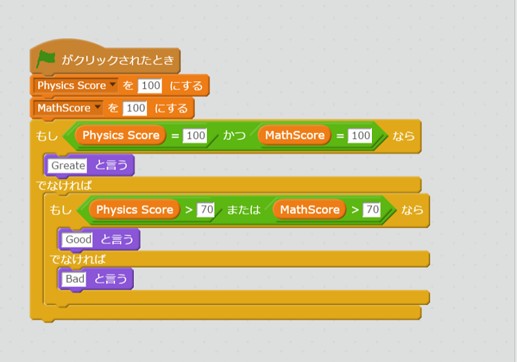

# <ruby>演算子<rt>えんざんし</rt></ruby>をもう<ruby>少<rt>すこ</rt></ruby>し<ruby>見<rt>み</rt></ruby>ていきましょう
または、とか、　かつ　という<ruby>演算子<rt>えんざんし</rt></ruby>もありましたね。

```
main(List<String> args) {
  var physicsScore = 100;
  var mathScore = 100;

  if(physicsScore == 100 && mathScore == 100) {
    print('Greate');
  } else if(physicsScore > 70 || mathScore > 70) {
    print('Good');
  } else {
    print('Bad');
  }
}

```

とScratchのコードを<ruby>比較<rt>ひかく</rt></ruby>してみましょう。



- かつ は && と<ruby>書<rt>か</rt></ruby>ける
- または は || と<ruby>書<rt>か</rt></ruby>ける

はい、Scratchのノウハウが<ruby>使<rt>つか</rt></ruby>えそうですね。

## Thanks

ここまで、<ruby>読<rt>よ</rt></ruby>んでくれてありがとう!!

では、<ruby>次回<rt>じかい</rt><ruby><ruby>会<rt>あ</rt></ruby>えることを、<ruby>楽<rt>たの</rt></ruby>しみにしています。

ではでは
