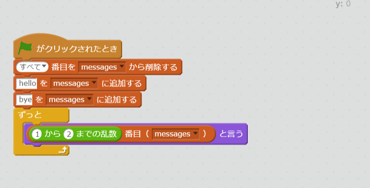

# ループ<ruby>機能<rt>きのう</rt></ruby>を<ruby>試<rt>ため</rt></ruby>してみよう


ランダムに「hello」と「bye」を<ruby>表示<rt>ひょうじ</rt></ruby>するコードです。
このCodeをDartで<ruby>書<rt>か</rt></ruby>いてみましょう。

```
import 'dart:math' as math;

main(List<String> args) {
  var rand = new math.Random();
  var messages = ["hello", "bye"];
  while(true) {
    print("${messages[rand.nextInt(2)]}");
  }
}
```
となります。

- リストの<ruby>生成<rt>せいせい</rt></ruby>は、var messages = ["hello", "bye"];    
Dartでは、<ruby>文字列<rt>もじれつ</rt></ruby>のListは、
```
var messages = ["hello", "bye"];
```
で、できます。
Scratchと<ruby>違<rt>ちが<rt></ruby>うのは、0から<ruby>始<rt>はじ</rt></ruby>まることです。
"hello"を<ruby>取得<rt>しゅとく</rt></ruby>したい<ruby>場合<rt>ばあい</rt></ruby>は、messages[0]、"bye"を<ruby>取得<rt>しゅとく</rt></ruby>したい<ruby>場合<rt>ばあい</rt></ruby>は、messages[1]とします。

- <ruby>乱数<rt>らんすう</rt></ruby>の<ruby>生成<rt>せいせい</rt></ruby>には、new math.Random()を<ruby>利用<rt>りよう</rt></ruby>する。  
Dartで<ruby>乱数<rt>らんすう</rt></ruby>を<ruby>生成<rt>せいせい</rt></ruby>させるには、'dart:math'パッケージを<ruby>利用<rt>りよう</rt></ruby>する<ruby>必要<rt>ひつよう</rt></ruby>があります。  
  - パッケージを<ruby>使<rt>つか</rt></ruby>う<ruby>宣言<rt>せんげん</rt></ruby>をする
```
import 'dart:math' as math;
```
  - <ruby>乱数<rt>らんすう</rt></ruby>を<ruby>生成<rt>せいせい</rt></ruby>する<ruby>準備<rt>じゅんび</rt></ruby>をする
```
var rand = new math.Random();
```
  - <ruby>生成<rt>せいせい</rt></ruby>します  
```
rand.nextInt(2)
```
0、1の<ruby>乱数<rt>らんすう</rt></ruby>が<ruby>生成<rt>されます
- ずっとは、while(true){}
```
var xxx = 0;
while(xxx>10) {
  xxx = xxx + 1;
}
```
のように、10<ruby>回<rt>かい</rt></ruby><ruby>実行<rt>じっこう</rt></ruby>したらループを<ruby>抜<rt>ぬ</rt></ruby>けるとかもできます。


## Thanks

ここまで、<ruby>読<rt>よ</rt></ruby>んでくれてありがとう!!

では、<ruby>次回<rt>じかい</rt><ruby><ruby>会<rt>あ</rt></ruby>えることを、<ruby>楽<rt>たの</rt></ruby>しみにしています。

ではでは
