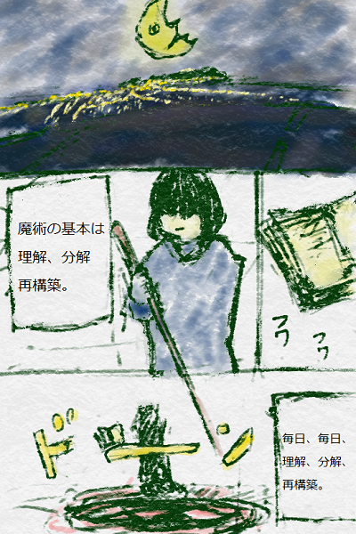
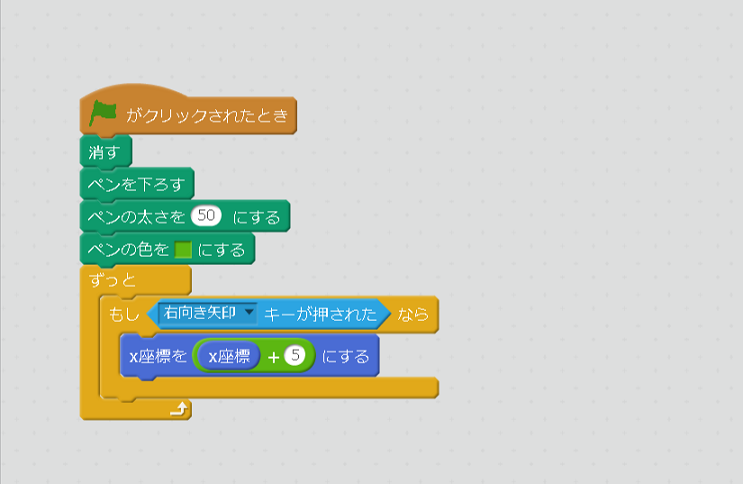
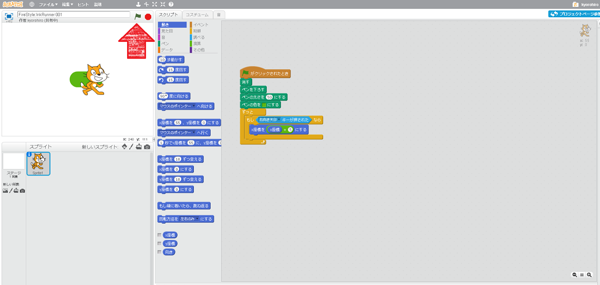
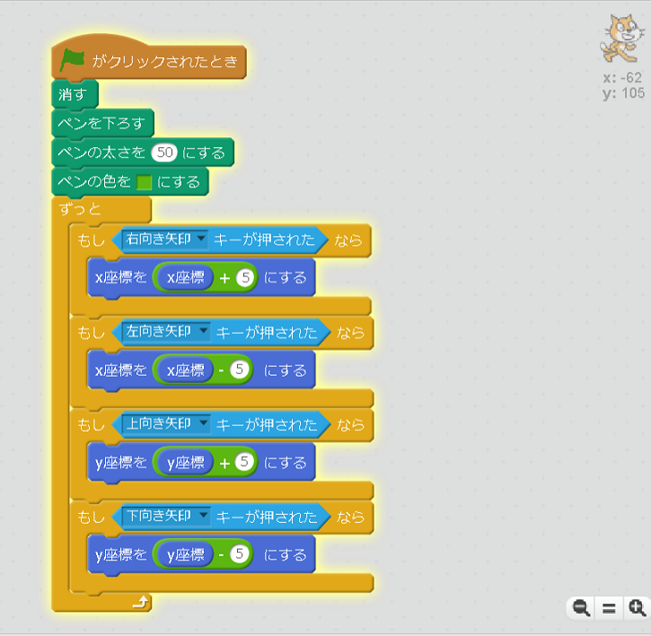
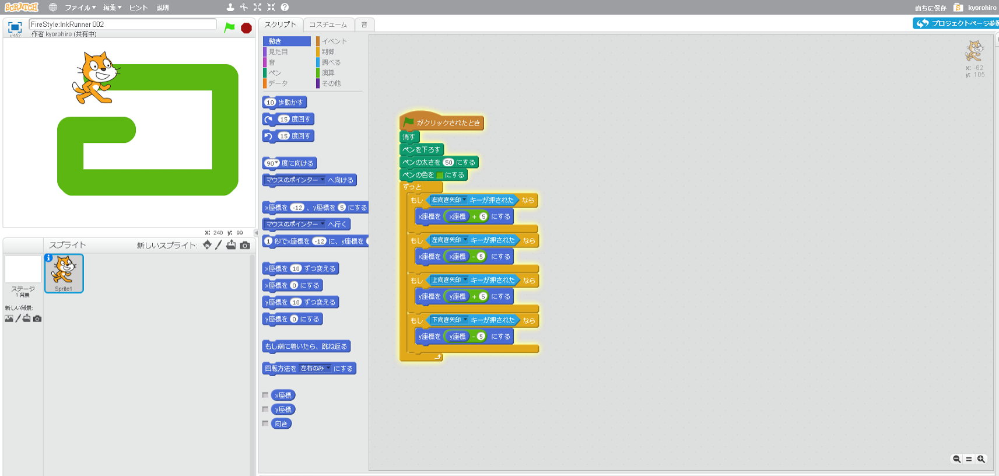

うーむ、また<ruby>失敗<rt>しっぱい</rt></ruby>した。

イライラ

よく、こんな<ruby>事<rt>こと</rt></ruby>を<ruby>続<rt>つづ</rt></ruby>けられますね。

..

そこが、いいんじゃないか。

　
# イカのインクゲームをHackしよう

## Scratchを<ruby>開<rt>ひら</rt></ruby>こう

まずは、このページは、<ruby>開<rt>ひら</rt></ruby>けていますか?
<ruby>開<rt>ひら</rt></ruby>けてなければ、<ruy>前回<rt>ぜんかい</rt></ruby>の<ruby>記事<rt>きじ</rt></ruby>を<ruby>見<rt>み</rt><ruby>てください。

## インクを<ruby>塗<rt>ぬ</rt></ruby>りながら、キャラクターが<ruby>動<rt>うご</rt></ruby>き<ruby>回<rt>まわ</rt></ruby>るゲームだね

### <ruby>右<rt>みぎ</rt></ruby>キーを<ruby>押<rt>お</rt></ruby>したら、<ruby>右<rt>みぎ</rt></ruby>に<ruby>移動<rt>いどう</rt></ruby>するようにする。

<ruby>以下<rt>いか</rt></ruby>のコードを、<ruby>追加<rt>ついか</rt></ruby>してみよう

  　

### <ruby>動作確認<rt>どうさかくにん</rt></ruby>してみよう!!

https://scratch.mit.edu/projects/133004465/

1. <ruby>旗<rt>はた</rt></ruby>をクリック
2. <ruby>右矢印<rt>みぎやじるし</rt></ruby>キーを<ruby>押<rt>お</rt></ruby>すと、キャラクターが<ruby>右<rt>みぎ</rt></ruby>に<ruby>動作<rt>どうさ</rt></ruby>することを、<ruby>確認<rt>かくにん</rt></ruby>してください

### Good!!

　
　
　
　
　
　
　
　
## <ruby>上下左右<rt>じょうげさゆう</rt></ruby>に<ruby>移動<rt>いどう</rt></ruby>できるようにしよう

## 動作を確認する
https://scratch.mit.edu/projects/133006409/

1. 旗をクリック
2. 右矢印キーを押すと、キャラクターが右に移動することを、確認してください

　
　

### Good!!

## Thanks

ここまで、<ruby>読<rt>よ</rt></ruby>んでくれてありがとう!!

では、<ruby>次回<rt>じかい</rt><ruby>、また
<ruby>会<rt>あ</rt></ruby>えることを、
<ruby>楽<rt>たの</rt></ruby>しみにしています。

そして、<ruby>次回<rt>じかい</rt></ruby>は、この続きをやります。

ではでは

