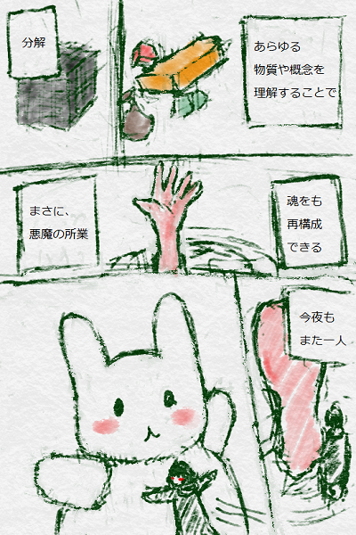

あなたの「したいこと」は、あなたのものです。

<ruby>今日<rt>きょう</rt></ruby>はイカのインクゲームを<ruby>作<rt>つく</rt></ruby>るけど、

<ruby>人<rt>ひと</rt></ruby>に<ruby>言<rt>い</rt></ruby>えないの「キャー」なことや「キャハ」なこととか

どんどん<ruby>試</ruby>すと<ruby>良<rt>よ</rt></ruby>いよ。

うーん、とりあえず、<ruby>全部<rt>ぜんぶ</rt></ruby>のプロックを<ruby>使<rt>つか</rt></ruby>ってみる。

とか。ださいかな。

まぁ、<ruby>私<rt>わたし</ry></ruby>は<ruby>試<rt>ため</rt></ruby>しちゃいましたけどね。

そういうの<ruby>好<rt>す</rt></ruby>きなんです。

なんでもどうぞ。

# Splatoon は、<ruby>対戦相手<rt>たいせんあいて</rt></ruby>がいるゲームですね

## <ruby>対戦相手<rt>たいせんあいて</rt></ruby>を<ruby>追加<rt>ついか</rt></ruby>する

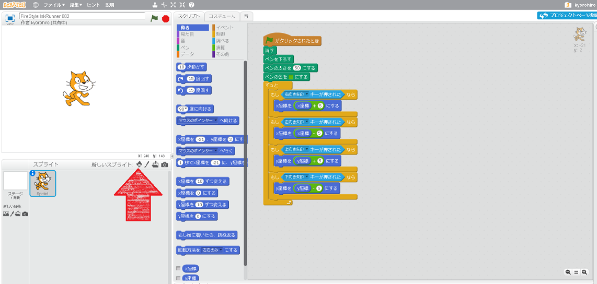

キャラクター<ruby>追加<rt>ついか</rt></ruby>アイコンをクリックする

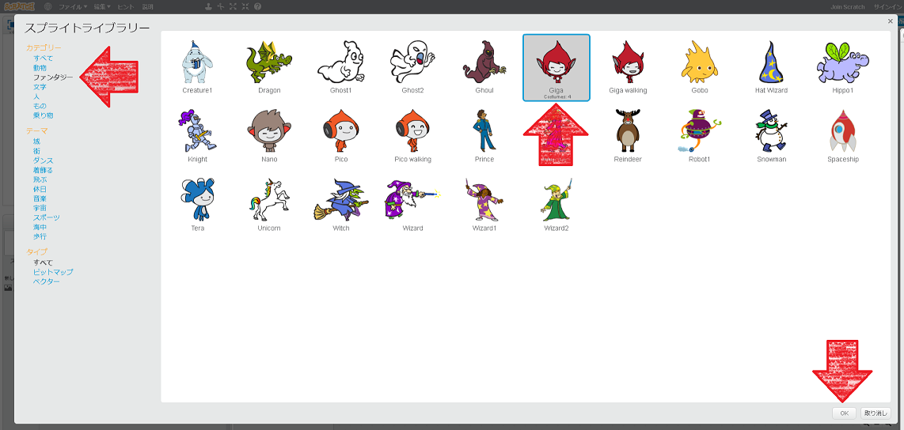

1. ファンタジー をクリック
2. Giga をクリック
3. OK をクリック

　
　
　
　
　
## <ruby>対戦相手<rt>たいせんあいて</rt></ruby>も<ruby>手動<rt>しゅどう</rt></ruby>で<ruby>動作<rt>どうさ</rt></ruby>させます

Sprite1に<ruby>追加<rt>ついか</rt></ruby>した<ruby>機能<rt>きのう</rt></ruby>と、ほとんど<ruby>同<rt>おな</rt></ruby>じです。

<ruby>同<rt>おな</rt></ruby>じように、コードを<ruby>追加<rt>ついか</rt></ruby>しても<ruby>良<rt>よ</rt></ruby>いですが
ショートカットしてみましょう。

#### Sprite1のコードを<ruby>表示<rt>ひょうじ</rt></ruby>する
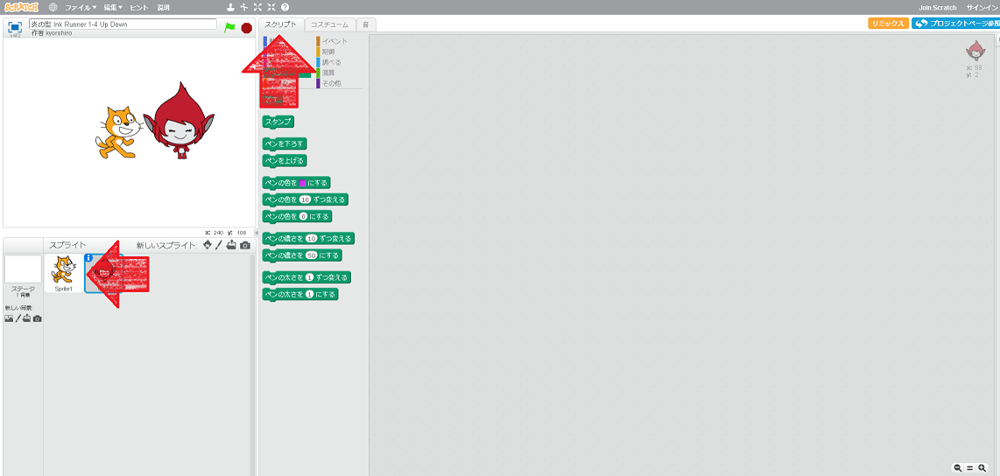

1. Sprite1をクリック
2. スクリプトタブをクリック

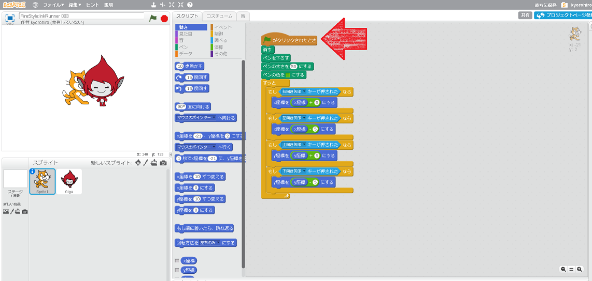

1. 「<ruby>旗<rt>はた</rt></ruby>がクリックされたら」に、マウスカーソルを合わせる
2. Shiftキーを<ruby>押<rt>お</rt></ruby>しながら、クリックする

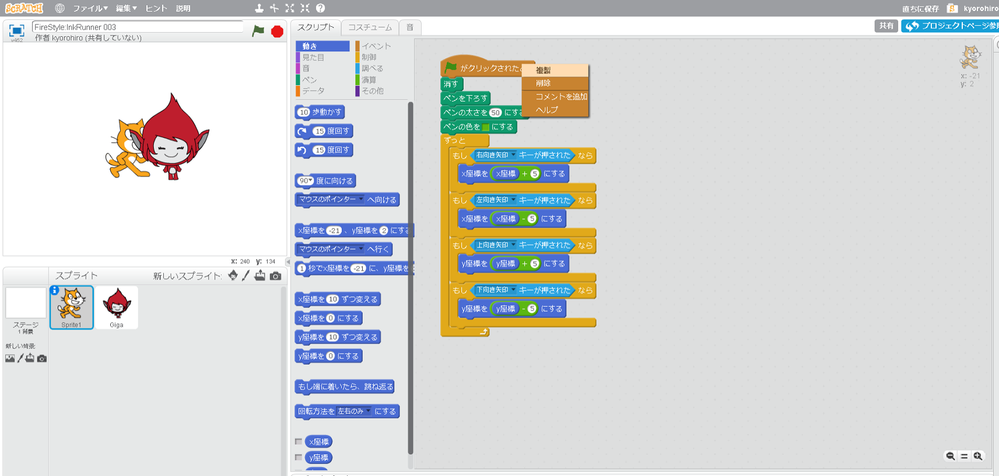

1. <ruby>複製<rt>ふくせい</rt></ruby>をクリック

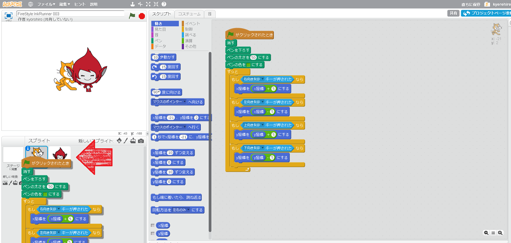

1. Gigaにカーソルを<ruby>合<rt>あ</rt></ruby>わせて
2. クリックする

#### コピーできたことを<ruby>確認<rt>かくにん</rt></ruby>する
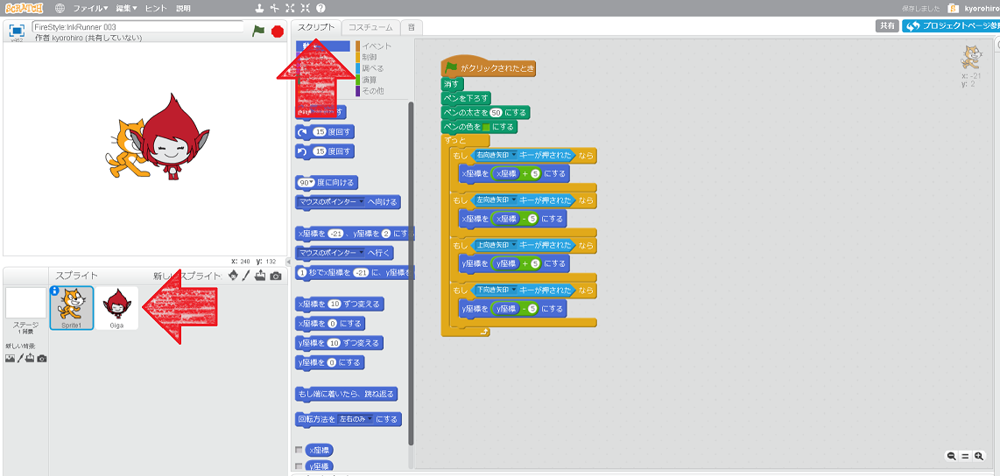

1. Gigaをクリック
2. スクリブトタブをクリック

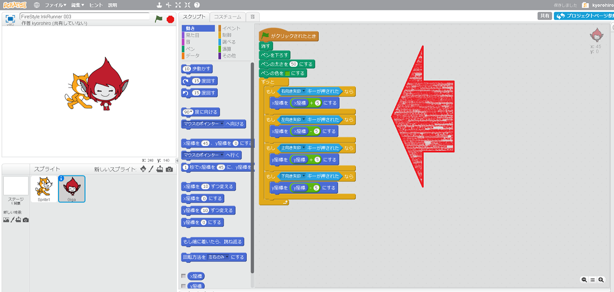

### <ruby>動作確認<rt>どうさかくにん</rt></ruby>してみよう!!
https://scratch.mit.edu/projects/133015084/

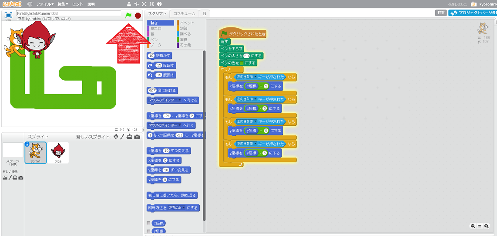

1. <ruby>旗<rt>はた</rt></ruby>をクリック
2. <ruby>右<rt>みぎ</rt></ruby><ruby>矢印<rt>やじるし</rt></ruby>キーを<ruby>押<rt>お</rt></ruby>すと、キャラクターが<ruby>右<rt>みぎ</rt></ruby>に<ruby>移動<rt>いどう</rt></ruby>することを、<ruby>確認<rt>かくにん</rt></ruby>してください

### Good!!

# <ruby>異<rt>こと</rt></runy>なるキーを<ruby>割<rt>わ</rt></ruby>り<ruby>振<rt>ふ</rt></ruby>るのと
<ruby>上下左右<rt>じょうげさゆう</rt></ruby>キーを<ruby>押<rt>お</rt></ruby>すと、<ruby>同<rt>おな</rt></ruby>じ<ruby>方向<rt>ほうこう</rt></ruby>にキャラクターが<ruby>動作<rt>どうさ</rt></ruby>するので
ゲームになりません。

Gigaのコードを<ruby>修正<rt>しゅうせい</rt></ruby>してみましょう
<ruby>異<rt>こと</rt><ruby>なるキーとペンの<ruby>色<rt>いろ</rt></ruby>を<ruby>割<rt>わ</rt></ruby>り<ruby>振<rt>ふ</rt></ruby>ってください

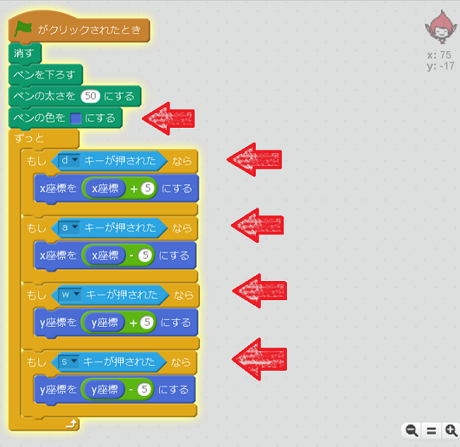

## <ruby>動作確認<rt>どうさかくにん</rt></ruby>する
https://scratch.mit.edu/projects/133027676/

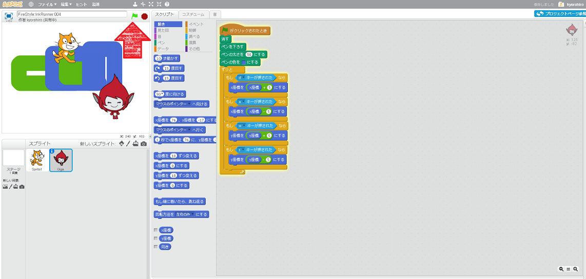

### Good!!

　　
　
## Thanks

ここまで、<ruby>読<rt>よ</rt></ruby>んでくれてありがとう!!

では、<ruby>次回<rt>じかい</rt><ruby>、また
<ruby>会<rt>あ</rt></ruby>えることを、
<ruby>楽<rt>たの</rt></ruby>しみにしています。

そして、<ruby>次回<rt>じかい</rt></ruby>は、この続きをやります。

ではでは

