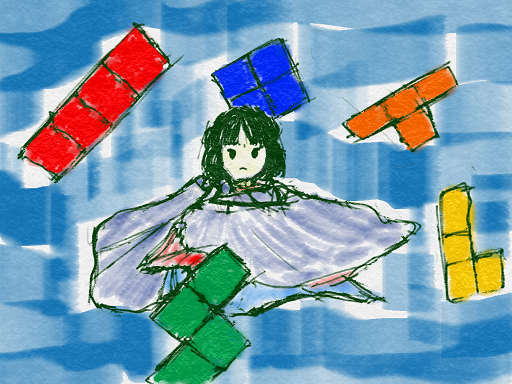

<ruby>砂<rt>すな</rt></ruby>の<ruby>感触<rt>かんしょく</rt></ruby>

<ruby>潮<rt>しお</rt></ruby>の<ruby>香<rt>かお</rt></ruby>り

<ruby>波<rt>なみ</rt></ruby>の<ruby>声<rt>こえ</rt></ruby>

<ruby>青<rt>あお</rt></ruby>い<ruby>空<rt>そら</rt></ruby>

<ruby>星<rt>ほし</rt></ruby>の<ruby>残<rt>のこ</rt></ruby>り<ruby>香<rt>か</rt></ruby>

そして、その<ruby>向<rt>む</rt></ruby>こう

<ruby>靜<rt>しず</rt></ruby>かに、<ruby>唱<rt>とな</rt></ruby>えた

# ゲームっぽくしていきましょう。
<ruby>勝敗<rt>しょうはい</rt></ruby>を<ruby>判定<rt>はんてい</rt></ruby>する<ruby>機能<rt>きのう</rt></ruby>を<ruby>追加<rt>ついか</rt></ruby>してみましょう。

<ruby>今回<rt>こんかい</rt></ruby>は<ruby>難易度<rt>なんいど</rt></ruby>がすこし<ruby>高<rt>たか</rt></ruby>いです。
<ruby>一気<rt>いっき</rt></ruby>に<ruby>突破<rt>とっぱ</rt></ruby>できた<ruby>君<rt>きみ</rt></ruby>はスゴイ

<ruby>何回<rt>なんかい</rt></ruby>かに<ruby>分<rt>わ</rt></ruby>けて<ruby>挑戦<rt>ちょうせん</rt></ruby>してね!!

## Bat2を<ruby>追加<rt>ついか</rt></ruby>
キャラクターを<ruby>追加<rt>ついか</rt></ruby>してみましょう!!

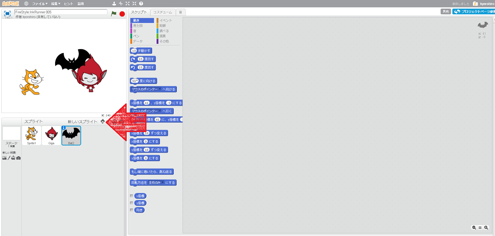
1. "<ruby>新<rt>あたら</rt></ruby>しいスプライト"のアイコンをクリック
2. <ruby>動物<rt>どうぶつ</rt></ruby>をクリック
3. Bat2をクリック
4. OKをクリック

## Bat2に30<ruby>秒<rt>びょう</rt></ruby>、<ruby>数<rt>かぞ</rt></ruby>えてもらう

#### コードを<ruby>追加<rt>ついか</rt><ruby>する
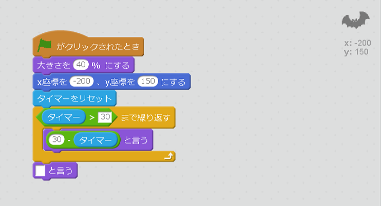

#### <ruby>動作確認<rt>どうさかくにん</rt></ruby>しよう
https://scratch.mit.edu/projects/134871575/

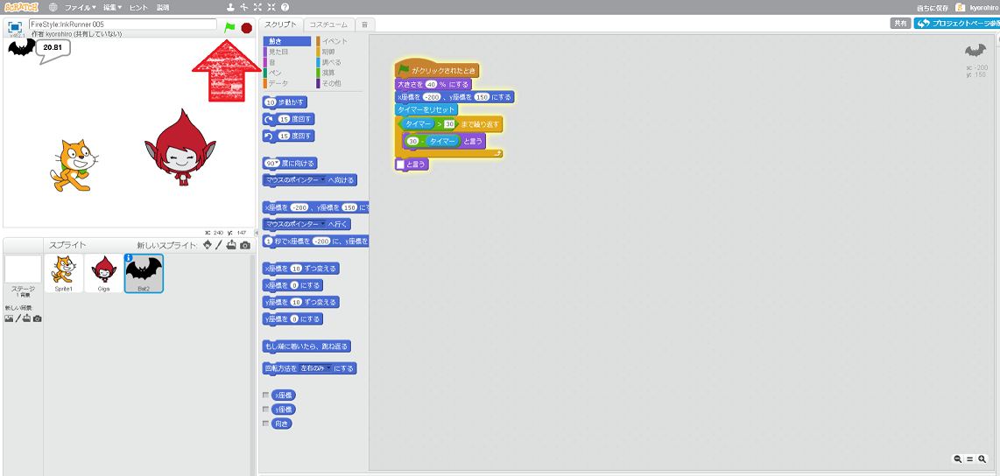

## 30<ruby>秒<rt>びょう</rt></ruby>すぎたら動けなくする
###  [-] Timeoutという<ruby>変数<rt>へんすう</rt></ruby>を<ruby>追加<rt>ついか</rt></ruby>しましょう

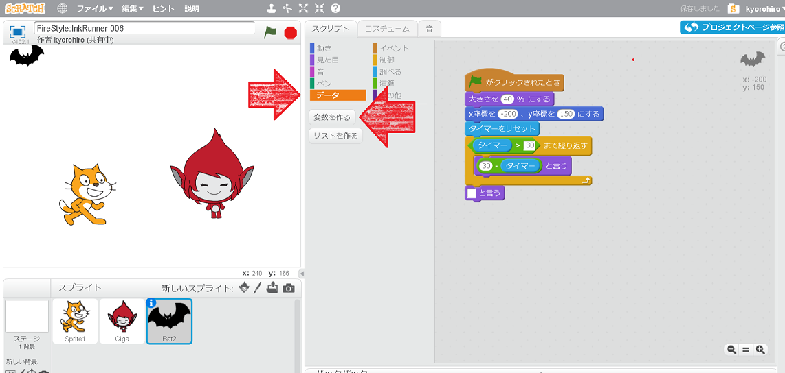
1. データをクリック
2. <ruby>変数<rt>へんすう</rt></ruby>を<ruby>作<rt>つく</rt></ruby>るをクリック

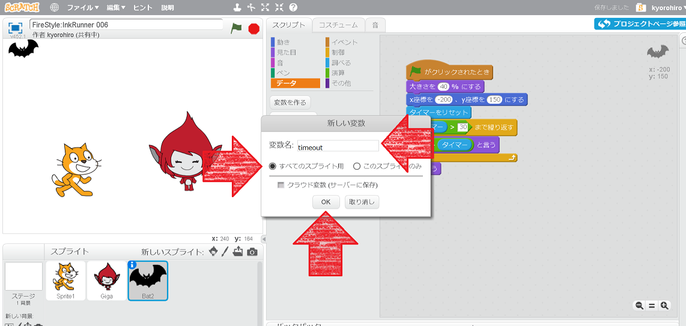

1. <ruby>変数名<rt>へんすうめい</rt></ruby>は timeout にする
2. すべてのスプライトをクリック
3. OKボタンを<ruby>押<rt>お</rt></ruby>す

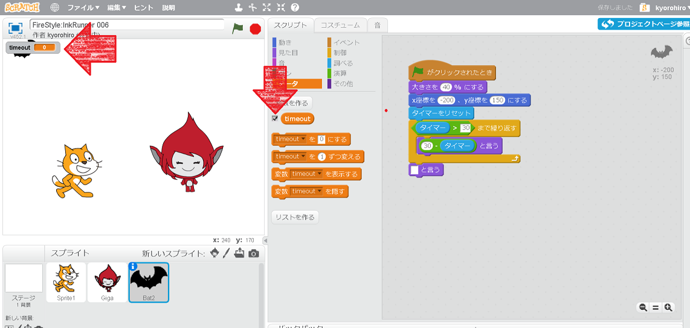

1. <ruby>選択肢<rt>せんたくし</rt></ruby>を<ruby>外<rt>はず</rt></ruby>して、<ruby>非表示<rt>ひひょうじ</rt></ruby>にする

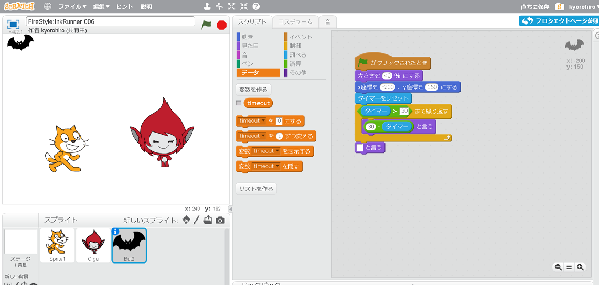

### [-] Bat2のコードを<ruby>変更<rt>へんこう</rt></ruby>する
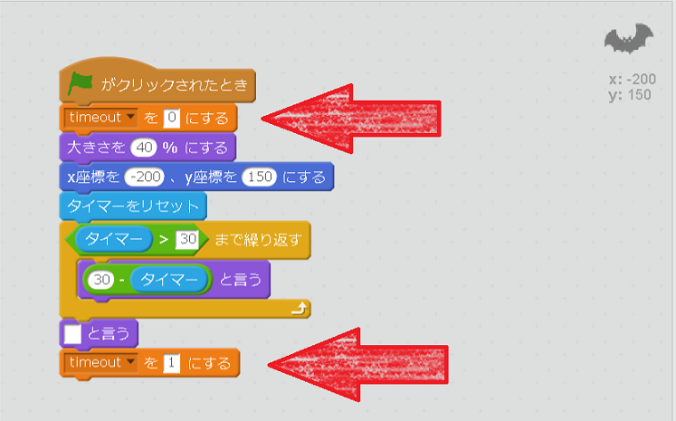

### [-] Sprite1のコードを<ruby>変更<rt>へんこう</rt></ruby>する
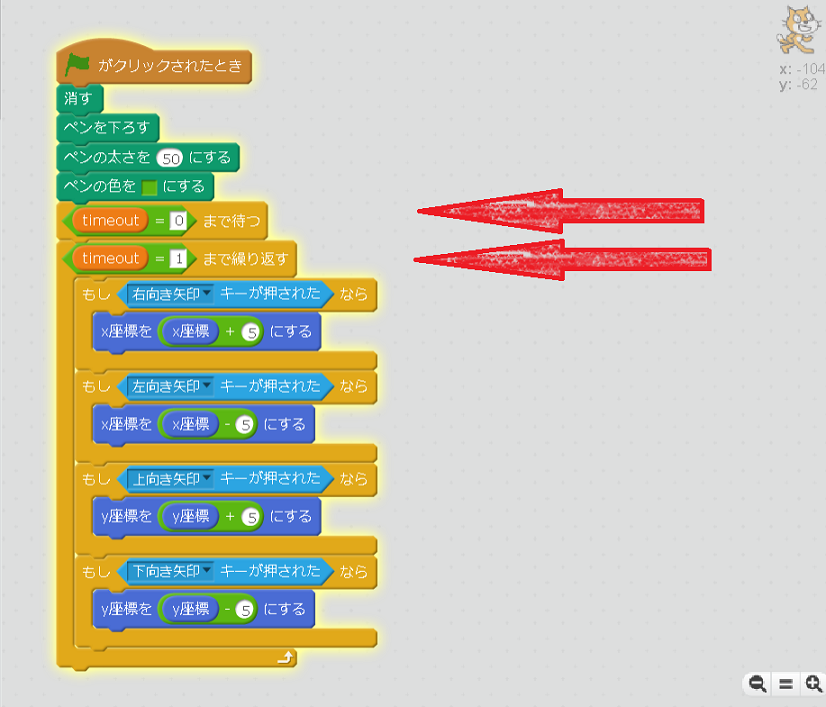

### [-] Gigaのコードを<ruby>変更<rt>へんこう</rt></ruby>する
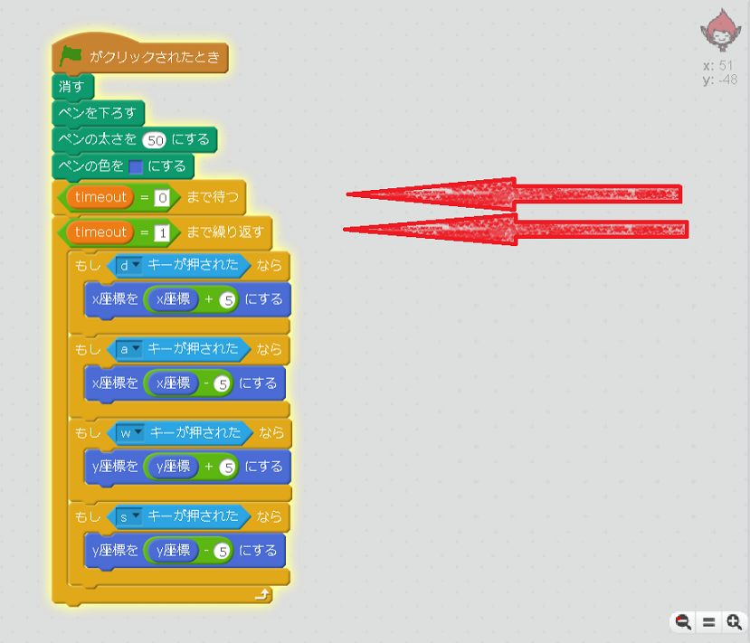

### <ruby>確認<rt>かくにん</rt></ruby>する
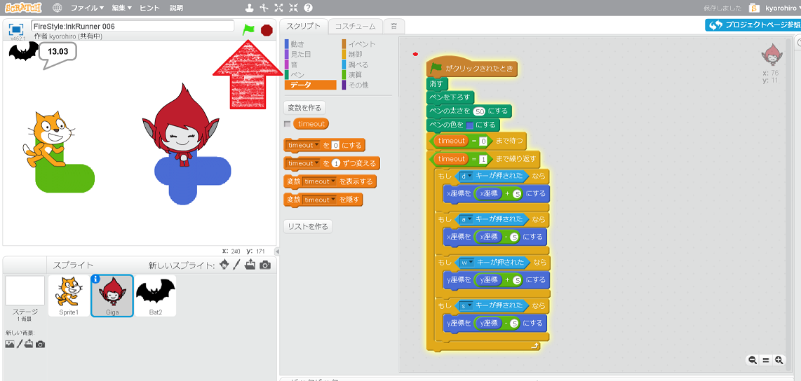

1. <ruby>旗<rt>はた</rt></ruby>をクリック
2. 30<ruby>秒経過前<rt>びょうけいかまえ</rt></ruby>は、キャラクターが<ruby>移動<rt>いどう</rt></ruby>できること
3. 30<ruby>秒経過後<rt>びょうけいかあと</rt></ruby>は、キャラクターが<ruby>移動<rt>いどう</rt></ruby>できないこと

### Good!!

## どちらの<ruby>色<rt>いろ</rt></ruby>が<ruby>多<rt>おお</rt></ruby>いか<ruby>判定<rt>はんてい</rt></ruby>する

### Bat2のコードを<ruby>変更<rt>へんこう</rt></ruby>する

※　変数を作る際は、「すべてのスプライト」を選択してください。

### <ruby>確認<rt>かくにん</rt></ruby>する
https://scratch.mit.edu/projects/134917820/

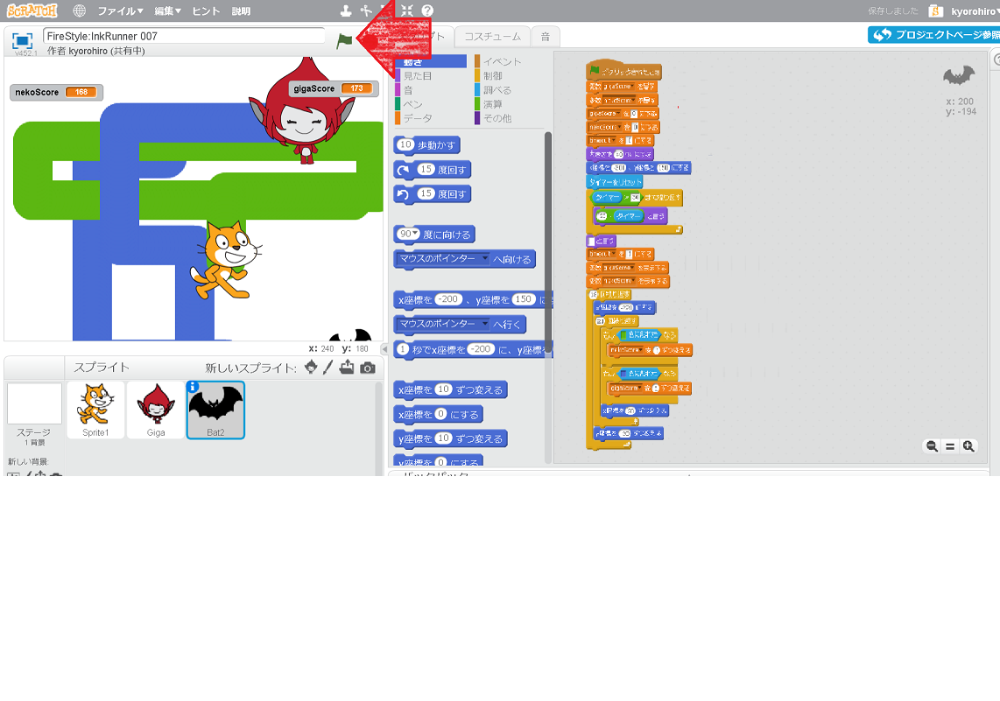

1. <ruby>旗<rt>はた</rt></ruby>をクリックする
2. キャラクターを<ruby>操作<rt>そうさ</rt></ruby>できること
3. Bat2がカウントしていること　　　
4. 30<ruby>秒<rt>びょう</rt></ruby><ruby>経過<rt>けいか</rt></ruby>した<ruby>後<rt>あと</rt></ruby>、<ruby>採点<rt>さいてん</rt></ruby>が<ruby>始<rt>はじ<rt></ruby>まること

### Good!!

これで、イカのインクゲームのチュートリアルは<ruby>一旦終了<rt>いったんしゅうりょう</rt></ruby>です。また<ruby>再会<rt>さいかい</rt></ruby>するかも

うーむ。

そうですね。

ゲームとしての<ruby>完成<rt>かんせい</rt></ruby>はまだこれからです。
あなたのアイデアをドンドンいれて<ruby>発展<rt>はってん</rt></ruby>させてみましょう

* <ruby>簡単<rt>かんたん</rt></ruby>なAIとか<ruby>追加<rt>ついか</rt></ruby>してみてはどうでしょうか。

そうすれば、<ruby>一人用<rt>ひとりよう</rt></ruby>のゲームにもなりますね。
<ruby>指定<rt>してい</rt></ruby>したルート<ruby>進><rt>すす</rt></ruby>むだけでも、<ruby>工夫次第<rt>くふうしだい</rt></ruby>でパズルゲームみたいになりますね。

* アイテムを<ruby>用意<rt>ようい</rt></ruby>するとか
* <ruby>地形<rt>ちけい</rt></ruby>を<ruby>作<rt>つく</rt></ruby>るとか

なんでもありです!!

## Thanks
ここまで、<ruby>読<rt>よ</rt></ruby>んでくれてありがとう!!

では、また<ruby>会<rt>あ</rt></ruby>えることを、
<ruby>楽<rt>たの</rt></ruby>しみにしています。

<ruby>次回<rt>じかい</rt><ruby>は、リミックスを利用して、
コラボレーションしてみましょう。

ではでは

　
