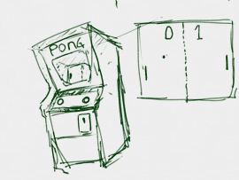

<ruby>火<rt>ひ</rt></ruby>と<ruby>水<rt>みず</rt></ruby>

<ruby>水<rt>みず</rt></ruby>と<ruby>土<rt>つち</rt></ruby>

<ruby>土<rt>つち</rt></ruby>と<ruby>風<rt>かぜ</rt></ruby>

<ruby>風<rt>かぜ</rt></ruby>と<ruby>空<rt>くう</rt></ruby>

<ruby>一見<rt>いっけん</rt></ruby><ruby>複雑<rt>ふくざつ</rt></ruby>なものも、<ruby>単純<rt>たんじゅん</rt></ruby>な<ruby>要素<rt>ようそ</rt></ruby>の<ruby>組<rt>く</r></ruby>み<ruby>合<rt>あ</rt></ruby>わせでできています。

　　
　　
　　

# Scratchマスターへの道

<ruby>定義<rt>ていぎ</rt></ruby>という<ruby>機能<rt>きのう</rt></ruby>があります。なくてもプログラムを<ruby>書<rt>か</rt></ruby>けますが。

あると、<ruby>頭<rt>あたま</rt></ruby>の<ruby>中<rt>なか</rt></ruby>を<ruby>整理<rt>せいり</rt></ruby>しながら<ruby>書<rt>か</rt></ruby>けます。

Pongというゲームを<ruby>作<rt>つく</rt></ruby>りながら、<ruby>試<rt>ため</rt></ruby>してみましょう。

## Pongとは
http://www.ponggame.org

Pongは<ruby>一般向<rt>いっぱんむけ</rt></ruby>けのTVゲームという<ruby>分野<rt>ぶんや</rt></ruby>が、<ruby>誕生<rt>たんじょう</rt></ruby>する、きっかけになったゲームです。

1972<ruby>年<rt>ねん</rt></ruby>11<ruby>年<rt>ねん</rt></ruby>にアタリ<ruby>社<rt>しゃ</rt></ruby>で<ruby>開発<rt>かいはつ</rt></ruby>されました。

Pongは<ruby>対戦<rt>たいせん</rt></ruby>ゲームです。<ruby>左右<rt>さゆう</rt></ruby>に<ruby>配置<rt>はいち</rt></ruby>されたラケットを、<ruby>上下<rt>じょうげ</rt></ruby>に<ruby>移動<rt>いどう</rt></ruby>させて、ボールを<ruby>打<rt>う</rt></ruby>ち<ruby>返<rt>かえ</rt></ruby>すゲームです。

<ruby>相手<rt>あいて</rt></ruby>にラケットで<ruby>打<rt>う</rt></ruby>ち<ruby>返<rt>かえ</rt></ruby>すことを<ruby>失敗<rt>しっぱい</rt></ruby>させると、<ruby>得点<rt>とくてん</rt></ruby>が<ruby>入<rt>はい</rt></ruby>ります。

<ruby>先<rt>さき</rt></ruby>に15<ruby>点<rt>てん</rt></ruby>を<ruby>先取<rt>せんしゅ</rt></ruby>したほうが<ruby>勝<rt>か</rt></ruby>ちとなります。

## Scratchで<ruby>作成<rt>さくせい</rt></ruby>してみよう

https://scratch.mit.edu/projects/77999912/

ボールが<ruby>青色<rt>あおいろ</rt></ruby>の<ruby>部分<rt>ぶぶん</rt></ruby>に<ruby>衝突<rt>しょうとつ</rt></ruby>すると、<ruby>右側<rt>みぎがわ</rt></ruby>に<ruby>得点<rt>とくてん</rt></ruby>が入(はい)ります。

ボールが<ruby>赤色<rt>あかいろ</rt></ruby>の<ruby>部分<rt>ぶぶん</rt></ruby>に<ruby>衝突<rt>しょうとつ</rt></ruby>すると、<ruby>左側<rt>ひだり</rt></ruby>に<ruby>得点<rt>とくてん</rt></ruby>が<ruby>入<rt>はい</rt></ruby>ります。

<ruby>上<rt>うえ</rt></ruby>キー、<ruby>下<rt>した</rt></ruby>キーを<ruby>押<rt>お</rt></ruby>すと、<ruby>灰色<rt>はいいろ</rt></ruby>のラケットが<ruby>上下<rt>じょうげ</rt></ruby>に<ruby>移動<rt>いどう</rt></ruby>します。

Aキー、Zキーを<ruby>押<rt>お</rt></ruby>すと、<ruby>黒色<rt>くろいろ</rt></ruby>にラケットが<ruby>上下<rt>じょうげ</rt></ruby>に<ruby>移動<rt>いどう</rt></ruby>します。

ボールにラケットが<ruby>衝突<rt>しょうとつ</rt></ruby>すると<ruby>跳<rt>は</rt></ruby>ね<ruby>返<rt>かえ</rt></ruby>ります。

## Thanks

ここまで、<ruby>読<rt>よ</rt></ruby>んでくれてありがとう!!

では、<ruby>次回<rt>じかい</rt><ruby>、また
<ruby>会<rt>あ</rt></ruby>えることを、
<ruby>楽<rt>たの</rt></ruby>しみにしています。

そして、<ruby>次回<rt>じかい</rt></ruby>からは、コードを<ruby>書<rt>か</rt></ruby>いていきます。

ではでは

