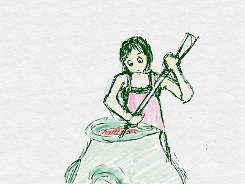
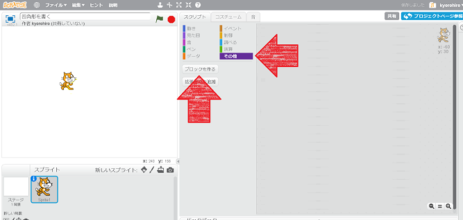
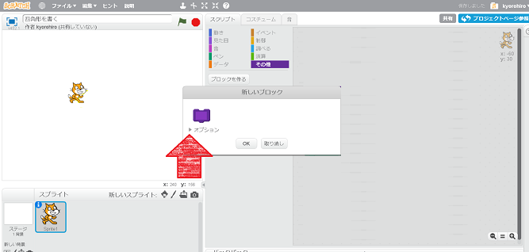
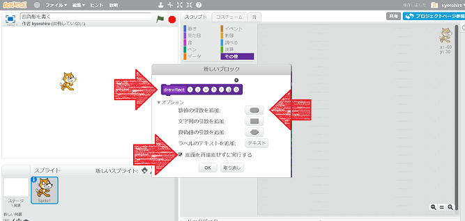
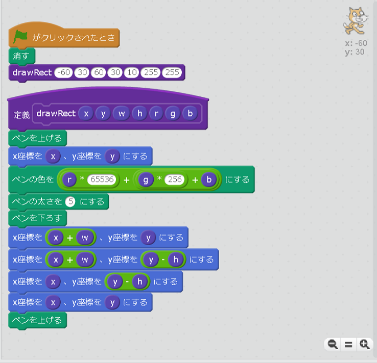
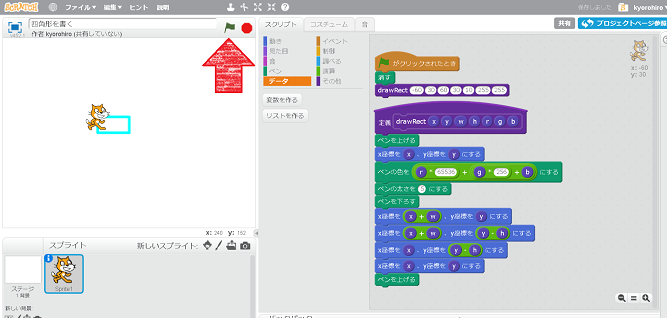
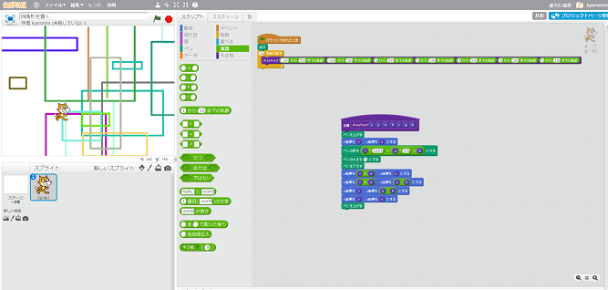

<ruby>火<rt>ひ</rt></ruby>の<ruby>魔法<rt>まほう</rt></ruby>も

<ruby>水<rt>みず</rt></ruby>の<ruby>魔法<rt>まほう</rt></ruby>も

<ruby>下<rt>した</rt></ruby>ごしらえが<ruby>大事<rt>だいじ</rt></ruby>

　
### <ruby>四角形<rt>しかっけい</rt></ruby>を<ruby>書<rt>か</rt></ruby>いてみましょう
<ruby>定義<rt>ていぎ</rt></ruby>とペンを<ruby>利用<rt>りよう</rt></ruby>して、 <ruby>四角形<rt>しかっけい</rt></ruby>を<ruby>書<rt>か</rt></ruby>いてみましょう

#### <ruby>定義<rt>ていぎ</rt></ruby>を<ruby>作成<rt>さくせい</rt></ruby>する

1. その<ruby>他<rt>た</rt></ruby>をクリック
2. ブロックを<ruby>作<rt>つく</rt></ruby>る

1. オプションをクリック

1. <ruby>定義名<rt>ていぎめい</rt></ruby>を<ruby>入力<rt>にゅうりょく</rt></ruby>
2. <ruby>数値<rt>すうち</rt></ruby>の<ruby>引数<rt>ひきすう</rt></ruby>を<ruby>追加<rt>ついか</rt></ruby>をクリックして、x,y,w,h,r,g,b を<ruby>追加<rt>ついか</rt></ruby>する
3. <ruby>画面<rt>がめん</rt></ruby>を<ruby>再描画<rt>さいびょうが</rt></ruby>せずに<ruby>実行<rt>じっこう</rt></ruby>するにチェックを入れる
4. OK ボタンをクリック

#### コードを書く

#### 動作確認してみる
https://scratch.mit.edu/projects/135933828/

1. <ruby>旗<rt>はた</rt></ruby>をクリックすると<ruby>四角形<rt>しかっけい</rt></ruby>が<ruby>描画<rt>びょうが</rt></ruby>されること

　

### <ruby>試<rt>ため</rt></ruby>してみよう
<ruby>作成<rt>さくせい</rt></ruby>した、<ruby>定義<rt>ていぎ</rt></ruby>を<ruby>利用<rt>りよう</rt></ruby>してみよう。

* <ruby>作成<rt>さくせい</rt></ruby>した<ruby>定義<rt>ていぎ</rt></ruby>を<ruby>使<rt>つか</rt></ruby>って、<ruby>四角形<rt>しかっけい</rt></ruby>をたくさん<ruby>書<rt>か</rt></ruby>いてみるとか

https://scratch.mit.edu/projects/136158231/

## Thanks

ここまで、<ruby>読<rt>よ</rt></ruby>んでくれてありがとう!!

では、<ruby>次回<rt>じかい</rt><ruby>、また
<ruby>会<rt>あ</rt></ruby>えることを、
<ruby>楽<rt>たの</rt></ruby>しみにしています。

そして、<ruby>次回<rt>じかい</rt></ruby>は、<ruby>今回作成<rt>こんかいさくせい</rt></ruby>したコードを<ruby>利用<rt>りよう</rt></ruby>して、コートを<ruby>作成<rt>さくせい</rt></ruby>します。

ではでは

