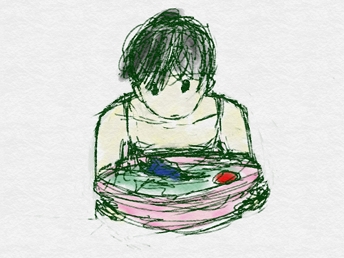
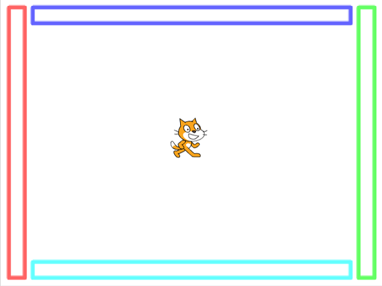
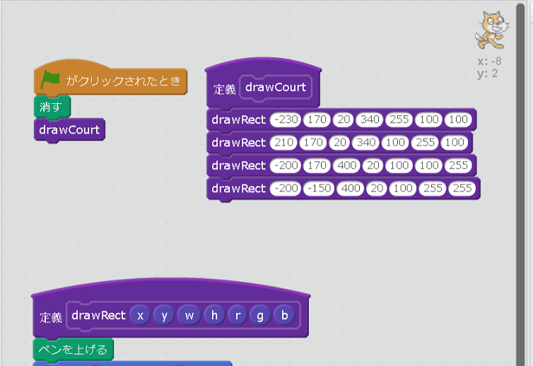
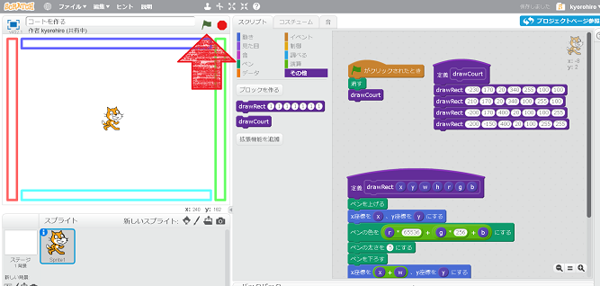
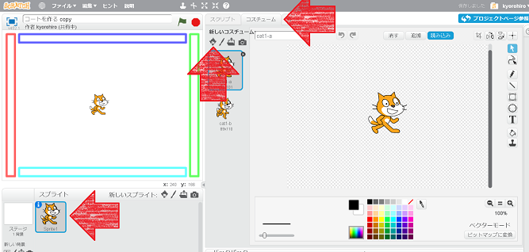
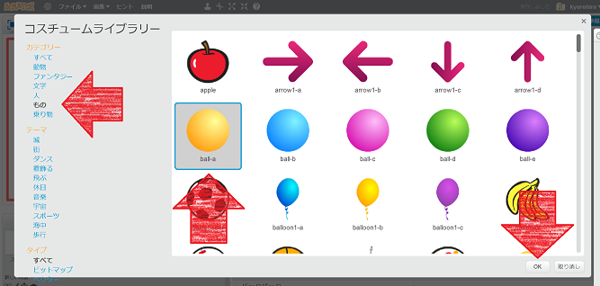
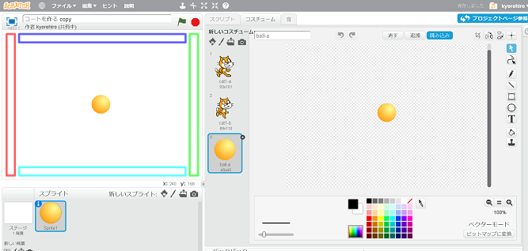

プログラマーは、<ruby>料理<rt>りょうり</rt></ruby>が<ruuby得意<rt>とくい</rt></ruby>...かもね!!

<ruby>下<rt>した</rt></ruby>ごしらえしたら、<ruby>調理<rt>ちょうり</rt></ruby>しよう!!

　
　　

## テニスコートを<ruby>作成<rt>さくせい</rt></ruby>しよう

<ruby>画面<rt>がめん</rt></ruby>の<ruby>端<rt>はし</rt></ruby>に、ボールを<ruby>跳<rt>は</rt></ruby>ね<ruby>返<rt>かえ</rt></ruby>す<ruby>仕切<rt>しきり</rt></ruby>を<ruby>作<rt>つく</rt></ruby>ろう

<ruby>上下左右<rt>じょうげさゆう</rt><ruby>は<ruby>別<rt>べつ</rt></ruby>の<ruby>色<rt>いろ</rt></ruby>にしてね。

### コードを<ruby>書<rt>か</rt></ruby>く

このコードを<ruby>追加<rt>ついか</rt></ruby>してね

### <ruby>確認<rt>かくにん</rt></ruby>する　
https://scratch.mit.edu/projects/136420808/

1. <ruby>旗<rt>はた</rt></ruby>をクリックすると、<ruby>端<rt>はし</rt></ruby>に<ruby>四角形<rt>しかっけい</rt></ruby>が<ruby>描画<rt>びょうが</rt></ruby>されること

　　　

　

## ネコをボールに変える　
ネコをPongのボールとして<ruby>利用<rt>りよう</rt></ruby>することにします。

1. Sprite1 をクリック
2. コスチュームをクリック
3. Spriteアイコンをクリック

1. ものをクリック
2. ball-aをクリック
3. OKをクリック

https://scratch.mit.edu/projects/136429229/

## Thanks

ここまで、<ruby>読<rt>よ</rt></ruby>んでくれてありがとう!!

では、<ruby>次回<rt>じかい</rt><ruby>、また
<ruby>会<rt>あ</rt></ruby>えることを、
<ruby>楽<rt>たの</rt></ruby>しみにしています。

そして、<ruby>次回<rt>じかい</rt></ruby>は、ボールに<ruby>動<rt>うご</rt></ruby>きをつけます

ではでは

