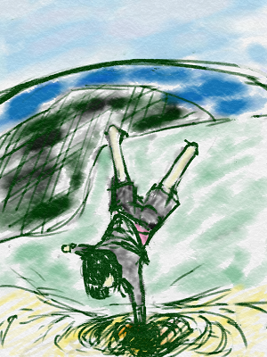
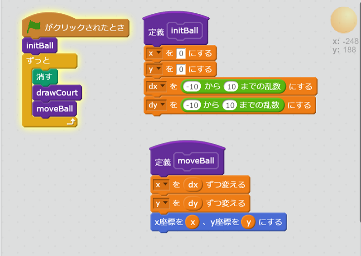
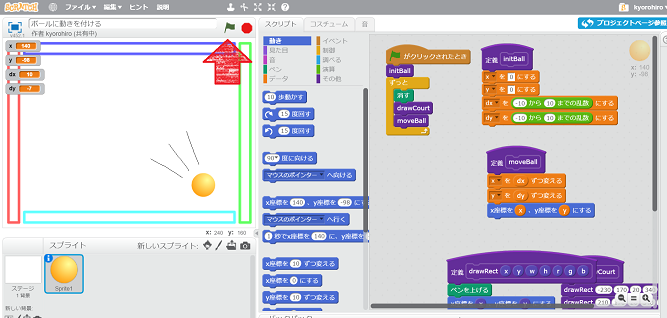
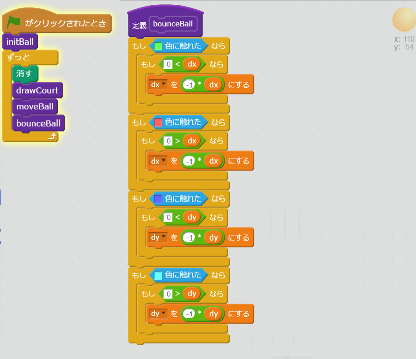
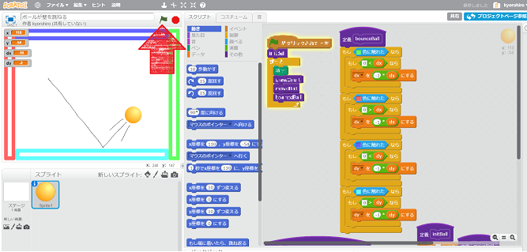

<ruby>大地<rt>だいち</rt></ruby>をつかんで

<ruby>理解<rt>りかい</rt></ruby>、<ruby>分解<rt>ぶんかい</rt></ruby>、<ruby>再構築<rt>さいこうちく</rt></ruby>

そして

<ruby>理解<rt>りかい</rt></ruby>、<ruby>分解<rt>ぶんかい</rt></ruby>、<ruby>再構築<rt>さいこうちく</rt></ruby>

# ボールに<ruby>動<rt>うご</rt></ruby>きを<ruby>付<rt>つ</rt></ruby>けよう

## まっすぐ<ruby>進<rt>すす</rt></ruby>ませてみる

### コードを<ruby>追加<rt>ついか</rt></ruby>する

### <ruby>確認<rt>かくにん</rt></ruby>する

https://scratch.mit.edu/projects/136834032/

1. <ruby>緑<rt>みどり</rt></ruby>の<ruby>旗<rt>はた</rt></ruby>をクリックすると、ボールが<ruby>動<rt>うご</rt></ruby>き<ruby>出<rt>だ</rt></ruby>すこと

　

## <ruby>壁<rt>かべ</rt></ruby>にぶつかると、Ballが<ruby>跳<rt>は</rt></ruby>ね<ruby>返<rt>かえ</rt></ruby>るようにしよう

### <ruby>確認<rt>かくにん</rt></ruby>する
https://scratch.mit.edu/projects/136834619/
　　　

1. <ruby>緑<rt>みどり</rt></ruby>の<ruby>旗<rt>はた</rt></ruby>をクリックすると、ボールが<ruby>動<rt>うご</rt></ruby>き<ruby>出<rt>だ</rt></ruby>すこと
2. ボールが<ruby>壁<rt>かべ</rt></ruby>にあたると<ruby>跳<rt>は</rt></ruby>ね<ruby>返<rt>かえ</rt></ruby>ること

## Thanks

ここまで、<ruby>読<rt>よ</rt></ruby>んでくれてありがとう!!

では、<ruby>次回<rt>じかい</rt><ruby>、また
<ruby>会<rt>あ</rt></ruby>えることを、
<ruby>楽<rt>たの</rt></ruby>しみにしています。

そして、<ruby>次回<rt>じかい</rt></ruby>は、ラケットを<ruby>追加<rt>ついか</rt></ruby>します

ではでは

