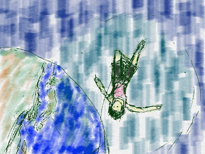
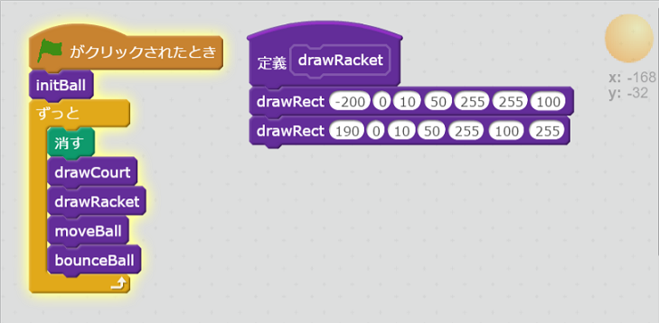
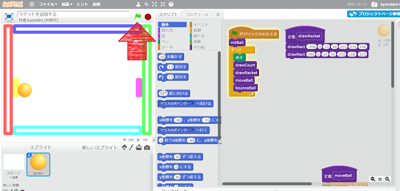
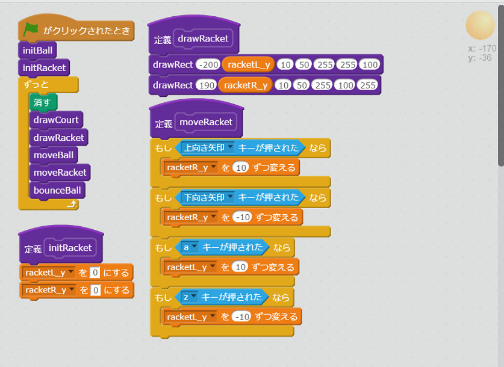
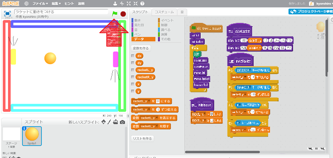

<ruby>宙<rt>そら</rt></ruby>をつかんで

<ruby>理解<rt>りかい</rt></ruby>、<ruby>分解<rt>ぶんかい</rt></ruby>、<ruby>再構築<rt>さいこうちく</rt></ruby>

そして

<ruby>理解<rt>りかい</rt></ruby>、<ruby>分解<rt>ぶんかい</rt></ruby>、<ruby>再構築<rt>さいこうちく</rt></ruby>

# ラケットを、<ruby>追加<rt>ついか</rt></ruby>しよう

## コードを<ruby>追加<rt>ついか</rt></ruby>する

## <ruby>確認<rt>かくにん</rt></ruby>する
https://scratch.mit.edu/projects/136838905/

1. <ruby>緑<rt>みどり</rt></ruby>の<ruby>旗<rt>はた</rt></ruby>をクリックすると、ラケットが<ruby>表示<rt>ひょょうじ</rt></ruby>されること

# ラケットに<ruby>動<rt>うご</rt></ruby>きを<ruby>付<rt>つ</rt></ruby>ける

## コードを<ruby>追加<rt>ついか</rt></ruby>する

## <ruby>確認<rt>かくにん</rt></ruby>する
https://scratch.mit.edu/projects/136839373/

1. <ruby>緑<rt>みどり</rt></ruby>の<ruby>旗<rt>はた</rt></ruby>をクリックすると、ラケットが<ruby>表示<rt>ひょうじ</rt></ruby>されること
2. <ruby>上<rt>うえ</rt></ruby>キーを<ruby>押<rt>お</rt></ruby>すと、<ruby>右側<rt>みぎがわ</rt></ruby>のラケットが<ruby>上<rt>うえ</rt></ruby>に<ruby>移動<rt>いどう</rt></ruby>すること
3. 下キーを<ruby>押<rt>お</rt></ruby>すと、<ruby>右側<rt>みぎがわ</rt></ruby>のラケットが、<ruby>下<rt>した</rt></ruby>に<ruby>移動<rt>いどう</rt></ruby>すること
4. aキーを<ruby>押<rt>お</rt></ruby>すと、<ruby>左側<rt>ひだりがわ</rt></ruby>のラケットが<ruby>上<rt>うえ</rt></ruby>に<ruby>移動<rt>いどう</rt></ruby>すること
5. zキーを<ruby>押<rt>お</rt></ruby>すと、<ruby>左側<rt>ひだりがわ</rt></ruby>のラケットが<ruby>下<rt>した</rt></ruby>に<ruby>移動<rt>いどう</rt></ruby>すること

## Thanks

ここまで、<ruby>読<rt>よ</rt></ruby>んでくれてありがとう!!

では、<ruby>次回<rt>じかい</rt><ruby>、また
<ruby>会<rt>あ</rt></ruby>えることを、
<ruby>楽<rt>たの</rt></ruby>しみにしています。

そして、<ruby>次回<rt>じかい</rt></ruby>は、ラケットにボールを<ruby>跳<rt></rt></ruby>ね<ruby>返<rt>かえ</rt></ruby>す<ruby>機能<rt>きのう</rt></ruby>を<ruby>追加<rt>ついか</rt></ruby>します

ではでは

