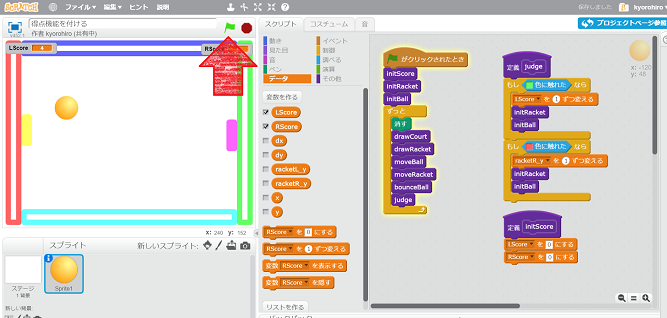

ケーキを<ruby>食<rt>た</rt></ruby>べながら

<ruby>理解<rt>りかい</rt></ruby>、<ruby>分解<rt>ぶんかい</rt></ruby>、<ruby>再構築<rt>さいこうちく</rt></ruby>

どんな<ruby>味<rt>あじ</rt></ruby>がするのかな

<ruby>材料<rt>ざいりょう</rt></ruby>は<ruby>何<rt>なに</rt></ruby>かな

どんな<ruby>香<rt>かおり</rt></ruby>がするのかな

<ruby>誰<rt>だれ</rt></ruby>が<ruby>作<rt>つく</rt></ruby>ったのかな

どこで<ruby>作<rt>つく</rt></ruby>られたのかな

...

# ラケットに<ruby>触<rt>ふ</rt></ruby>れるとボールが<ruby>跳<rt>は</rt></ruby>ね<ruby>返<rt>かえ</rt></ruby>るようにする

## コードを<ruby>追加<rt>ついか</rt></ruby>する

## <ruby>確認<rt>かくにん</rt></ruby>する

https://scratch.mit.edu/projects/136840391/

1. <ruby>緑<rt>みどり</rt></ruby>の<ruby>旗<rt>はた</rt></ruby>をクリックすると、ボールか<ruby>動<rt>うご</rt></ruby>き<ruby>出<rt>だ</rt></ruby>すこと
2. <ruby>黄色<rt>きいろ</rt></ruby>のラケットに<ruby>当<rt>あた</rt></ruby>ると、ボールが<ruby>跳<rt>は</rt></ruby>ね<ruby>返<rt>は</rt></ruby>ること
3. <ruby>紫色<rt>むらさきいろ</rt></ruby>のラケットに<ruby>当<rt>あた</rt></ruby>ると、ボールが<ruby>跳<rt>は</rt></ruby>ね<ruby>返<rt>は</rt></ruby>ること

　　
　　
　　
　　

　
# <ruby>得点<rt>とくてん</rt></ruby>が<ruby>入<rt>はい</rt></ruby>るようにする

## コードを<ruby>追加<rt>ついか</rt></ruby>する

## <ruby>確認<rt>かくにん</rt></ruby>する
https://scratch.mit.edu/projects/136840911/

1. <ruby>緑<rt>みどり</rt></ruby>の<ruby>旗<rt>はた</rt></ruby>をクリックすると、ボールか<ruby>動<rt>うご</rt></ruby>き<ruby>出<rt>だ</rt></ruby>すこと
2. <ruby>赤色<rt>あかいろ</rt></ruby>の<ruby>壁<rt>かべ</rt></ruby>に<ruby>当<rt>あた</rt></ruby>ると、RScoreに<ruby>得点<rt>とくてん</rt></ruby>が<ruby>入<rt>はい</rt></ruby>ること
3. <ruby>緑色<rt>みどりいろ</rt></ruby>の<ruby>壁<rt>かべ</rt></ruby>に<ruby>当<rt>あた</rt></ruby>ると、LScoreに<ruby>得点<rt>とくてん</rt></ruby>が<ruby>入<rt>はい</rt></ruby>ること

## チュートリアルはここまで、

Pongのチュートリアルはここまで、
もっと、<ruby>色々<rt>いろいろ</rt></ruby>と<ruby>機能追加<rt>きのうついか</rt></ruby>してゲームを<ruby><rt>かんせい</rt></ruby>させよう

アイデアをドンドン<ruby>詰<rt>つ</rt></ruby>め<ruby>込<rt>こ</rt></ruby>もう。

* Kyorohiroはサーブのルールを<ruby>変<rt>か</rt></ruby>えたりしてみました。
https://scratch.mit.edu/projects/136841605/#player

　
## Thanks

ここまで、<ruby>読<rt>よ</rt></ruby>んでくれてありがとう!!

では、<ruby>次回<rt>じかい</rt><ruby>、また
<ruby>会<rt>あ</rt></ruby>えることを、
<ruby>楽<rt>たの</rt></ruby>しみにしています。

そして、<ruby>次回<rt>じかい</rt></ruby>は、<ruby>色々<rt>いろいろ</rt></ruby>、<ruby>小<rt>こ</rt></ruby>ネタを<ruby>紹介<rt>しょうかい</rt></ruby>していきます

ではでは

