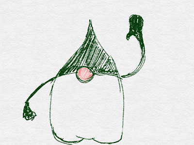
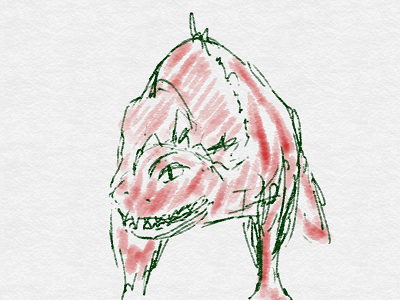
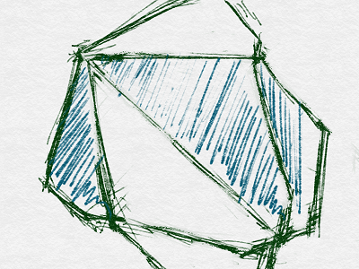
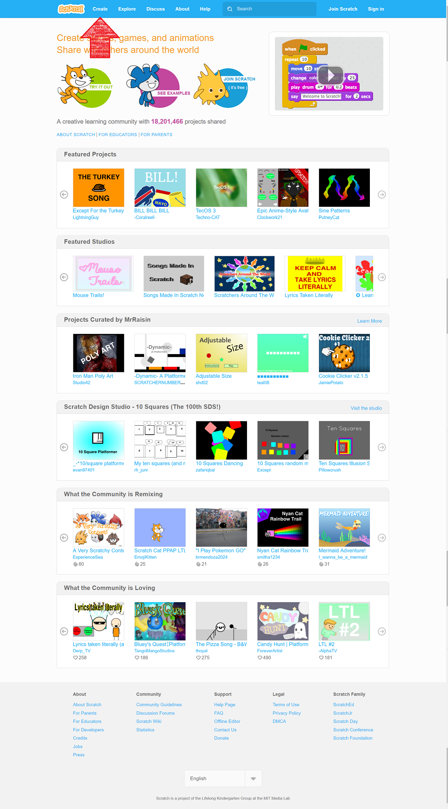
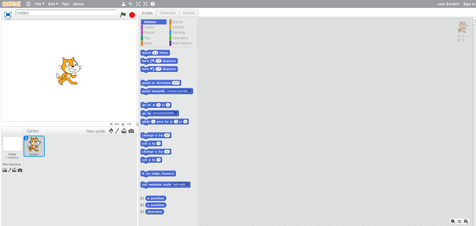

A: まだ、<ruby>始<rt>はじ</rt></ruby>めたばかりで、<ruby>何<rt>なに</rt></ruby>もできませんけどね。

T: はじめようと<ruby>考<rt>かんが</rt></ruby>えた<ruby>時<rt>とき</rt></ruby>から <ruby>人<rt>ひと</rt></ruby>は<ruby>変</ruby>わり<ruby>始</ruby>めていると<ruby>思<rt>おも</rt></ruby>いますわ

# Scratch から<ruby>始</ruby>めよう
「どんなプログラムでを<ruby>書<rt>か</rt></ruby>いてみたいですか?」

「どんなアプリケーションを<ruby>作<rt>つく</rt></ruby>ってみたいですが?」

「プログラムを<ruby>書<rt>か</rt></ruby>いてみたいですか」

「なにか、あれこれ、<ruby>作<rt>つく</rt></ruby>ってみたいですか」

「ロボットを<ruby>動<rt>うご</rt></ruby>かしたりとか。」

「ゲームを<ruby>作<rt>つく</rt></ruby>ったりとか。」

 Scratch からプログラムを<ruby>始<rt>はじ</rt></ruby>めてみませんか!!

### Scratchなら、すぐに<ruby>始<rt>はじ</rt></ruby>められる
プログラマーは<ruby>様々<rt>さまざま</rt></ruby>な、<ruby>言語<rt>げんご</rt></ruby>を<ruby利用<rt>りよう</rt></ruby>してプログラムを<ruby>書<rt><か/rt></ruby>きます.

もう、プログラム<ruby>言語<rt>げんご</rt></ruby>はたくさんあります。
https://ja.wikipedia.org/wiki/%E3%83%97%E3%83%AD%E3%82%B0%E3%83%A9%E3%83%9F%E3%83%B3%E3%82%B0%E8%A8%80%E8%AA%9E%E4%B8%80%E8%A6%A7

100<ruby>個<rt>こ</rt></ruby><ruby>以上<rt>いじょう</rt></ruby>ありますね。

<ruby>私<rt>わたし</rt></ruby>が<ruby>使<rt>つか</rt></ruby>ったことがある<ruby>言語<rt>げんご</rt></ruby>の、いくつかを<ruby>解説<rt>かいせつ</rt></ruby>しましょう。

#### C : ハッカーなあなたに!!

　1972<ruby>年<rt>ねん</rt></ruby>にAT&Tベル<ruby>研究所<rt>けんきゅぅじょ</rt></ruby>で<ruby>生<rt>う</rt></ruby>まれました。
  <ruby>移植<rt>いしょく</rt></ruby>の<ruby>容易性<rt>よういせい</rt></ruby>、<ruby>自由度<rt>じゆうど</rt></ruby>、<ruby>実行速度<rt>じつこうそくど</rt></ruby>、を<ruby>追求<rt>ついきゅう</rt></ruby>した<ruby>手続<rt>てつづ</rt></ruby>き<ruby>型<rt>かた</rt></ruby>プログラミング<ruby>言語<rt>げんご</rt></ruby>です。
　しかし、そのために、コンパイル<ruby>後<rt>ご</rt></ruby>の<ruby>安全性<rt>あんぜんせい</rt></ruby>を<ruby>犠牲<rt>ぎせい</rt></ruby>にしました。

　少しのミスで、メモリー<ruby>空間<rt>くうかん</rt></ruby>を、<ruby>破壊<rt>はかい</rt></ruby>しつくしてしまう<ruby>凶暴性<rt>きょうぼうせい</rt></ruby>から、
　<ruby>使<rt>つか</rt></ruby>う<ruby>人<rt>ひと</rt></ruby>を<ruby>選<rt>えら</rt></ruby>びます。

　パフォーマンス<ruby>優先<rt>ゆうせん</rt></ruby>で、<ruby>低<rt>てい</rt></ruby>レベルのレイヤーもゴリゴリいじりたい<ruby>人向<rt>ひとむけ</rt></ruby>けです。
  ハッカーがよく<ruby>利用<rt>りよう</rt></ruby>するLinuxのカーネルは、90%<ruby>以上<rt>いじょう</rt></ruby>がC<ruby>言語<rt>げんご</rt></ruby>で<ruby>書<rt>かか</rt></ruby>かかれています。
  Hacker<ruby>必須<rt>ひっす</rt></ruby>の<ruby>言語<rt>げんご</rt></ruby>といって<ruby>良<rt><よ/rt></ruby>いです。

#### Java : <ruby>誠実<rt>せいじつ</rt></ruby>なあなたに

 1995<ruby>年<rt>ねん</rt></ruby>にサン・マイクロシステムズで<ruby>生<rt>う</rt></ruby>まれました。
 <ruby>最新鋭<rt>さいしんえい</rt></ruby>の <ruby>非同期処理<rt>ひどうきしょり</rt></ruby>、クラスベースのオブジェクト<ruby>指向<rt>しこう</rt></ruby>を、<ruby>標準装備<rt>ひょうじゅんそうび</rt></ruby>

 C<ruby>言語<rt>げんご</rt></ruby><ruby>習得者<rt>しゃうとくしゃ</rt></ruby>なら<ruby>容易<rt>ようい</rt></ruby>に<ruby>習得<rt>しゅうとく</rt></ruby>できる<ruby>言語設計<rt>げんごせっけい</rt></ruby>ながらコンパイル<ruby>後<rt>ご</rt></ruby>の<ruby>安全性<rt>あんぜんせい</rt></ruby>も<ruby>考慮<rt>こうりょ</rt></ruby>しており。

 <ruby>初学者<rt>しょがくしゃ</rt></ruby>にも<ruby>安心<rt>あんしん</rt></ruby>して<ruby>使<rt><つか/rt></ruby>えると<ruby>共<rt>とも</rt></ruby>に、<ruby>最新鋭<rt>さいしんえい</rt></ruby>の<ruby>装備<rt>そうび</rt></ruby>を<ruby>自由自在<rt>じゆうじざい</rt></ruby>に<ruby>利用<rt>りよう</rt></ruby>できる。
　<ruby>夢<rt>ゆめ</rt></ruby>の<ruby>言語<rt>げんご</rt></ruby>でした。

#### JavaScript : Web Page を<ruby>作<rt>つく</rt></ruby>りたいあなたに

 1996<ruby>年<rt>ねん</rt></ruby>にネットスケープコミュニケーションズで<ruby>生<rt>う</rt></ruby>まれた。もともとはLiveScriptと<ruby>呼<rt>よ</rt></ruby>ばれていたが、Javaの<ruby>人気<rt>にんき</rt></ruby>にあやかりJavaScriptと<ruby>改名<rt>かいめい</rt></ruby>した。
 プロトタイプベースのオブジェクト<ruby>指向<rt>しこう</rt></ruby>を<ruby>装備<rt>そうび</rt></ruby>しており。メジャーなWebブラウザー<ruby>上<rt>じょう</rt></ruby>で<ruby>動作<rt>どうさ</rt></ruby>する。

 Webページ<ruby>上</ruby>で<ruby>動作<rt>どうさ</rt></ruby>するプログラムを<ruby>書<rt><か/rt></ruby>くのに<ruby>必須<rt>ひっす</rt></ruby>の<ruby>言語<rt>げんご</rt></ruby>であるる

#### Lisp : <ruby>数学<rt>すうがく</rt></ruby><ruby>好<rt>す</rt></ruby>きのあなたに

 1958<ruby>年<rt>ねん</rt></ruby>にMITで<ruby>生<rt>う</rt></ruby>まれました。

 <ruby>高級言語<rt>こうきゅぅげんご</rt></ruby>としては、2<ruby>番目<rt>ばんめ</rt></ruby>の<ruby>子<rt>こ</rt></ruby>で<ruby>最古<rt>さいこ</rt></ruby>の<ruby>言語<rt>げんご</rt></ruby>のひとつである。

 <ruby>今<rt>いま</rt></ruby>まで<ruby>紹介<rt>しょうかい</rt></ruby>した<ruby>言語<rt>げんご</rt></ruby>と<ruby>違<rt>ちが</rt></ruby>い、<ruby>関数型<rt>かんすう</rt></ruby>プログラミングをサポートしている。
 このため、<ruby>数学的<rt>すうがくてき</rt></ruby>に<ruby>問題<rt>もんだい</rt></ruby>を<ruby>扱<rt>あつか</rt></ruby>う<ruby>事<rt>こと</rt></ruby>ができる。
 http://www.cse.chalmers.se/~rjmh/Papers/whyfp.html

#### Scratch : <ruby>初学者<rt>しょがくしゃ</rt></ruby>のあなたに

　2006<ruby>年<rt>ねん</rt></ruby>にMITメディアラボで<ruby>生<rt>う</rt></ruby>まれた。プログラミング<ruby>言語<rt>げんご</rt></ruby>を<ruby>学習<rt>がくしゅう</rt></ruby>する<ruby>人向<rt>ひとむ</rt></ruby>けに<ruby>開発<rt>かいはつ</rt></ruby>された<ruby>言語<rt>げんご</rt></ruby>です。「HelloWorld<ruby>症候群<rt>しょうこうぐん</rt></ruby>」の<ruby>特効薬<rt>とっこうやく</rt></ruby>である。

HelloWorld<ruby>症候群<rt>しょうこうぐん</rt></ruby>にかかると「そもそも、プログラムって<ruby>何<rt>なに</rt></ruby>」?と<ruby>右<rt>みぎ</rt></ruby>も<ruby>左<rt>ひだり</rt></ruby>もわからない<ruby>初心者<rt>しょしんしゃ</rt></ruby>が、<ruby>右往左往<rt></rt>うおうさおう</ruby>したのち、プログラムの<ruby>開発環境<rt>かいはつかんきょう</rt></ruby>をいれた<ruby>段階<rt>だんかい</rt></ruby>で<ruby>情熱<rt>じょうねつ</rt></ruby>も、<ruby>気力<rt>きりょく</rt></ruby>も、<ruby>吸<rt>す</rt></ruby>い<ruby>取<rt>と</rt></ruby>られてしまう。

#### Dart : <ruby>愛<rt>あい</rt></ruby>が<ruby>溢<rt>あふ</rt></ruby>れるあなたに

この<ruby>記事<rt>きじ</rt></ruby>の<ruby>作者<rt>さくしゃ</rt></ruby>であるkyorohiroが<ruby>好<rt>す</rt></ruby>きな、<ruby>言語<rt>げんご</rt></ruby>

<ruby>超<rt>ちょう</rt></ruby>クールなすごい<ruby>奴<rt>やつ</rt></ruby>

# Scratchの<ruby>開発画面<rt>かいはつがめん</rt></ruby>を<ruby>開<rt>ひせく</rt></ruby>く

1. https://scratch.mit.edu/ にアクセスしてください。

2. "Create" ないし "<ruby>作</ruby>る" をクリックしてください

<ruby>開発画面<rt>かいはつがめん</rt></ruby>が<ruby>表示<rt>ひょうじ</rt></ruby>されました。

この<ruby>画面<rt>がめん</rt></ruby>を<ruby>操作<rt>そうさ</rt></ruby>して、ゲームを<ruby>作成<rt>さくせい</rt></ruby>していきます。

# Good!!

ここまで、<ruby>読<rt>よ</rt></ruby>んでくれてありがとう!!

では、<ruby>次回<rt>じかい</rt><ruby>、また
<ruby>会<rt>あ</rt></ruby>えることを、
<ruby>楽<rt>たの</rt></ruby>しみにしています。

<ruby>次回<rt>じかい</rt></ruby>から、<ruby>実際<rt>じっさい</rt></ruby>にコードを<ruby>書<rt>か</rt></ruby>いていきます。

ではでは

