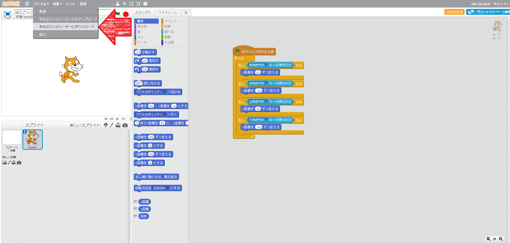

いく<ruby>千<rt>せん</rt></ruby>の<ruby>困難<rt>こんなん</rt></ruby>が<ruby>君<rt>きみ</rt></ruby>を<ruby>襲<rt>おそ</rt></ruby>うだろう。

ひとつは、<ruby>左膝<rt>ひだりひざ</rt></ruby>に<ruby>刺<rt>さ</rt></ruby>さり、<ruby>前<rt>まえ</rt></ruby>へ<ruby>進<rt>すす</rt></ruby>む<ruby>事<rt>こと</rt></ruby>ができない

ひとつは、<ruby>右手<rt>みぎて</rt></ruby>に<ruby>刺<rt>さ</rt></ruby>さり、<ruby>剣<rt>けん</rt></ruby>を<ruby>振<rt>ふ</rt></ruby>るう<ruby>事<rt>こと</rt></ruby>ができない

そして、<ruby>最悪<rt>さいあく</rt></ruby>の<ruby>魔獣<rt>まじゅう</rt></ruby>が<ruby>現<rt>あらわ</rt></ruby>れた。

<ruby>仲間<rt>なかま</rt></ruby><ruby>探<rt>さが</rt></ruby>しの<ruby>旅<rt>たび</rt></ruby>にでよう。

##  Scratchに<ruby>参加<rt>さんか</rt></ruby>してみよう。

Scratchに<ruby>参加<rt>さんか</rt></ruby>する<ruby>事<rt>こと</rt></ruby>でさまざまなサポートを<ruby>受<rt>う</rt></ruby>ける<ruby>事<rt>こと</rt></ruby>ができます。
* <ruby>作品<rt>さくひん</rt></ruby>を<ruby>記録<rt>きろく</rt></ruby>したり
* <ruby>作品<rt>さくひん</rt></ruby>を<ruby>発表<rt>はっぴょう</rt></ruby>したり
* <ruby>友達<rt>ともだち</rt></ruby>になったり
* <ruby>情報交換<rt>じょうほうこうかん<rt></ruby>したり
* <ruby>共同作業<rt>きょうどうさぎょう</rt></ruby>したり

## <ruby>参加</ruby>してみる
では<ruby>参加</ruby>してみましょう。
※ メールアドレスが<ruby>必要</ruby>になります。

「Scratchに<ruby>参加<rt>さんか</rt></ruby>しよう」をクリック

ユーザー<ruby>名<rt>めい</rt></ruby>とパスワードを<ruby>入力<rt>にゅうりょく</rt></ruby>してから、「<ruby>次<rt>つぎ</rt></ruby>へ」をクリック

<ruby>生年月日<rt>せいねんがっぴ</rt></ruby><ruby>等<rt>など</rt></ruby>を<ruby>入力<rt>にゅうりょく</rt></ruby>してくてから、「<ruby>次<rt>つぎ</rt></ruby>へ」をクリック

メールアドレスを<ruby>入力<rt>にゅうりょく</rt></ruby>してから、「<ruby>次<rt>つぎ</rt></ruby>へ」をクリック

さぁ、はじめよう!をクリック

　
メールが<ruby>届<rt>とど</rt></ruby>いているはずなので、<ruby>指定<rt>してい</rt></ruby>されたボタンを<ruby>押<rt>お</rt></ruby>して、Join<ruby>完了<rt>かんりょう</rt></ruby>です。
　
　
　

　
## <ruby>何<rt>なに</rt></ruby>か<ruby>作<rt>つく</rt></ruby>って<ruby>公開<rt>こうかい</rt></ruby>してみよう
<ruby>簡単<rt>かんたん</rt></ruby>なゲームを<ruby>作<rt>つく</rt></ruby>って<ruby>公開<rt>こうかい</rt></ruby>してみましょう

### <ruby>開発画面<rt>かいはつがめん</rt></ruby>に<ruby>移動<rt>いどう</rt></ruby>する

<ruby>作<rt>つく</rt></ruby>るをクリック

### <ruby>何<rt>なに</rt></ruby>か<ruby>書<rt>か</rt></ruby>く
<ruby>何<rt>なに</rt></ruby>かコードを<ruby>書<rt>か</rt></ruby>いてみましょう。

アプリ<ruby>名<rt>めい</rt></ruby>もいれようね。

<ruby>私<rt>わたし</rt></ruby>は、Neko Jump という<ruby>名前<rt>なまえ</rt></ruby>にしました。

### <ruby>保存<rt>ほぞん</rt></ruby>する

1. ファイル
2. ただちに<ruby>保存<rt>ほぞん</rt></ruby>

### <ruby>公開<rt>こうかい</rt></ruby>する

プロジェクトページ<ruby>参照<rt>さんしょう</rt></ruby>　をクリック

<ruby>共有<rt>きょうゆう</rt></ruby>ボタンをクリックすると、<ruby>公開<rt>こうかい</rt></ruby>されます。
<ruby>公開<rt>こうかい</rt></ruby>されると、<ruby>他<rt>ほか</rt></ruby>の<ruby>人<rt>ひと</rt></ruby>も<ruby>見<rt>み</rt></ruby>に<ruby>来<rt>く</rt></ruby>るので、
<ruby>使<rt>つか</rt></ruby>い<ruby>方<rt>かた</rt></ruby>とかも、<ruby>書<rt>か</rt></ruby>くようにしましょう。

kyorohiroは、<ruby>以下<rt>いか</rt></ruby>に<ruby>公開<rt>こうかい</rt></ruby>しました。
https://scratch.mit.edu/projects/133177809/

　
　
　
　
　
　

# [5-1] Good!!

<ruby>良<rt>よ</rt></ruby>くできました。<ruby>次<rt>つぎ</rt></ruby>のステップに<ruby>進<rt>すす</rt></ruby>みましょう!!

## Thanks

ここまで、<ruby>読<rt>よ</rt></ruby>んでくれてありがとう!!

では、<ruby>次回<rt>じかい</rt><ruby>、また
<ruby>会<rt>あ</rt></ruby>えることを、
<ruby>楽<rt>たの</rt></ruby>しみにしています。

そして、<ruby>次回<rt>じじかい</rt></ruby>からは、ミニゲームを<ruby>作<rt>つく</rt></ruby>っていきます。

ではでは

　
# おまけ : <ruby>会員登録<rt>かいいんとうろく</rt></ruby>しない<ruby>人向<rt>ひとむ</rt></ruby>け

## PCに<ruby>保存<rt>ほぞん</rt></ruby>する

ファイル

<ruby>手元<rt>てもと</rt></ruby>のコンピューターにダウンロード

1. <ruby>保存場所<rt>ほぞんばしょ</rt></ruby>を<ruby>選<rt>えら</rt></ruby>んで
2. <ruby>保存<rt>ほぞん</rt></ruby>

※　わかりやすい<ruby>名前<rt>なまえ</rt></ruby>にしようね!!

## PCから<ruby>読<rt>よ</rt></ruby>み<ruby>込<rt>こ</rt></ruby>む

ファイルをクリック

<ruby>手元<rt>てもと</rt></ruby>のコンピュータからアップロード

1. xxxx.sb2 と<ruby>書<rt>か</rt></ruby>かれてファイルをクリック
2. <ruby>開<rt>ひら</rt></ruby>くボタンをクリック

OKボタンをクリックする。

