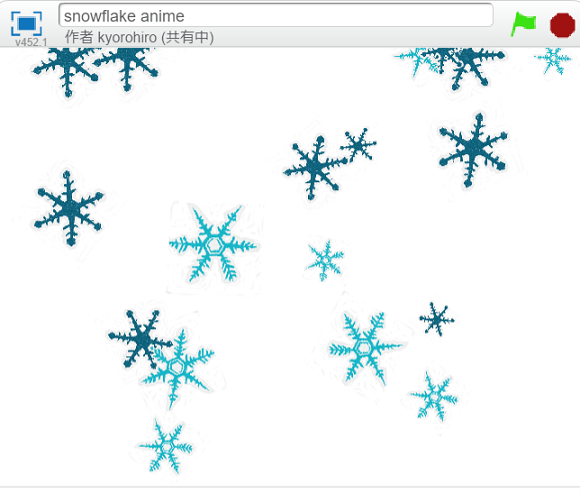
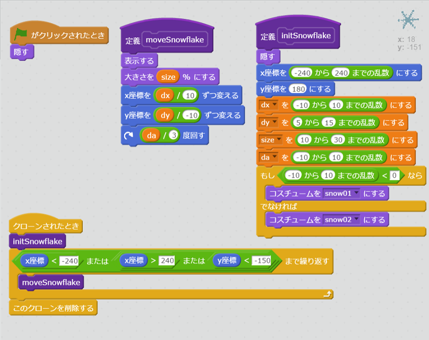
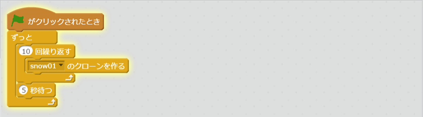
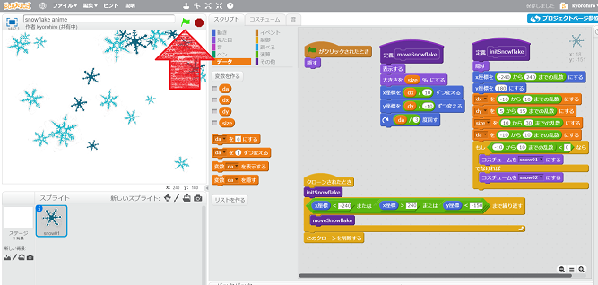

# <ruby>雪<rt>ゆき</rt></ruby>の<ruby>結晶<rt>けっしょう</rt></ruby>を<ruby>降<rt>ふ</rt></ruby>らしてみよう

## クローンを<ruby>使<rt>つか</rt></ruby>ってみよう
クローンを<ruby>使<rt>つか</rt></ruby>って<ruby>雪<rt>ゆき</rt></ruby>の<ruby>結晶<rt>けっしょう</rt></ruby>を<ruby>降<rt>ふ</rt></ruby>らすアニメーションを<ruby>作<rt>つく</rt></ruby>ってみよう。

## コードを追加

### <ruby>雪<rt>ゆき</rt></ruby>の<ruby>結晶<rt>けっしょう</rt></ruby>の<ruby>絵<rt>え</rt></ruby>を<ruby>書<rt>か</rt></ruby>いて、スクリプトを<ruby>追加<rt>ついか</rt></ruby>する

* <ruby>initSnowflake<rt>ゆき の けっしょう を しょきか する</rt></ruby>  
  「<ruby>画面<rt>がめん</rt></ruby>を<ruby>再描画<rt>さいびょうが</rt></ruby>せずに<ruby>実行<rt>じっこう</rt></ruby>する」にチェックをいれる

* <ruby>moveSnowflake<rt>ゆき の けっしょう を いどう する</rt></ruby>    
「<ruby>画面<rt>がめん</rt></ruby>を<ruby>再描画<rt>さいびょうが</rt></ruby>せずに<ruby>実行<rt>じっこう</rt></ruby>する」にチェックをいれる
* 変数について    
  「このスプライトのみ」にチェックをいれる

### <ruby>背景<rt>はいけい</rt></ruby>にスクリプトを<ruby>追加<rt>ついか</rt></ruby>する

### <ruby>確認<rt>かくにん</rt></ruby>する
https://scratch.mit.edu/projects/137147204/

1. <ruby>緑<rt>みどり</rt></ruby>の<ruby>旗<rt>はた</rt></ruby>をクリックすると、<ruby>雪<rt>ゆき</rt></ruby>の<ruby>結晶<rt>けっしょう</rt></ruby>が<ruby>降<rt>ふ</rt></ruby>ること

### どう<ruby>組<rt>く</rt></ruby>む?

どのような<ruby>順番<rt>じゅんばん</rt></ruby>でコードを<ruby>組<rt>く</rt></ruby>むと<ruby>良<rt>よ</rt></ruby>いでしょうか?
* クローンを、<ruby>使<rt>つか</rt></ruby>ったことがないので、クローンを<ruby>試<rt>ため</rt></ruby>すところから作る。
* <ruby>雪<rt>ゆき</rt></ruby>の<ruby>結晶<rt>けっしょう</rt></ruby>の<ruby>動<rt>うご</rt></ruby>きを<ruby>作<rt>つく</rt></ruby>るところから<ruby>始<rt>はじ</rt></ruby>める。

どれも<ruby>正解<rt>せいかい</rt></ruby>だと<ruby>思<rt>おも</rt></ruby>います。

<ruby>私<rt>わたし</rt></ruby>は<ruby>以下<rt>いか</rt></ruby>の<ruby>順番<rt>じゅんばん</rt></ruby>で<ruby>組<rt>く</rt></ruby>みました

1. <ruby>雪<rt>ゆき</rt></ruby>の<ruby>結晶<rt>けっしょう</rt></ruby>の<ruby>絵<rt>え</rt></ruby>を<ruby>描<rt>か</rt></ruby>く
2. クローンして<ruby>増<rt>ふ</rt></ruby>やしてみる
3. クローンした<ruby>結晶<rt>けっしょう</rt></ruby>を<ruby>動<rt>うご</rt></ruby>かしてみる
4. <ruby>移動速度<rt>いどうそくど</rt></ruby>やサイズをランダムに<ruby>変更<rt>へんこう</rt></ruby>するようにしてみる

## Thanks

ここまで、<ruby>読<rt>よ</rt></ruby>んでくれてありがとう!!

では、<ruby>次回<rt>じかい</rt><ruby>、また
<ruby>会<rt>あ</rt></ruby>えることを、
<ruby>楽<rt>たの</rt></ruby>しみにしています。

Scratchでは、いろんな<ruby>人</ruby>か<ruby>作成<rt>さくせい</rt></ruby>したアプリやそのコードが<ruby>公開<rt>こうかい</rt></ruby>されています。

ドンドン<ruby>遊<rt>あそ</rt></ruby>んで、ドンドン<ruby>参考<rt>さんこう</rt></ruby>にしましょう

ではでは

