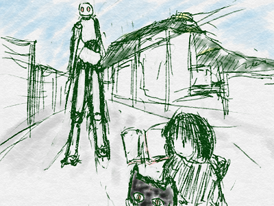
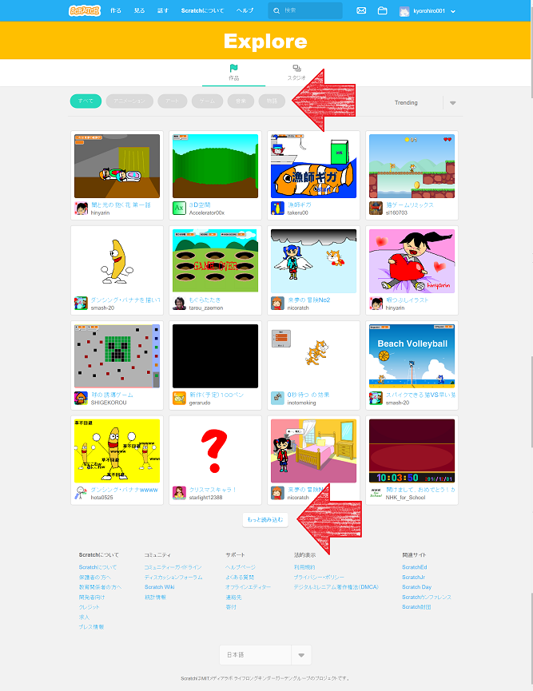
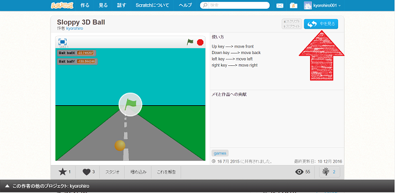
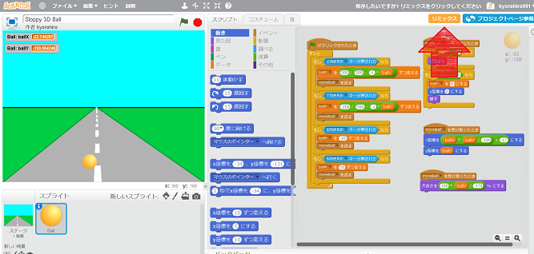
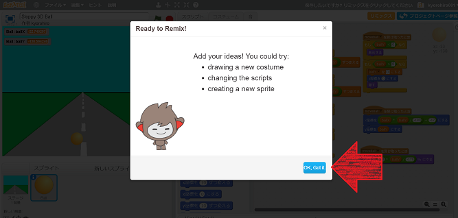
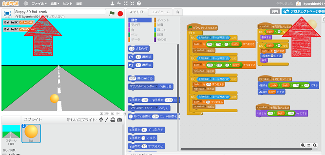
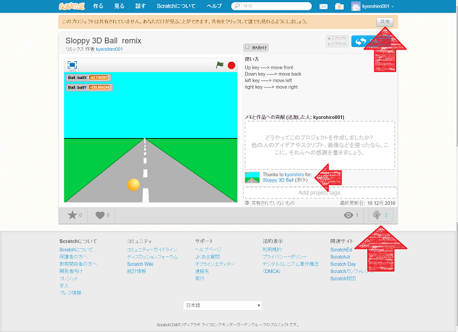

いろんな<ruby>人<rt>ひと</rt></ruby>にアイデアをベースに

<ruby>息吹<rt>いぶき</rt></ruby>を<ruby>吹<rt>ふ</rt></ruby>き<ruby>込<rt>こ</rt></ruby>もう

# <ruby>他<rt>ほか</rt></ruby>の<ruby>人<rt>ひと</rt></ruby>が<ruby>作<rt>つく</rt></ruby>ったアプリを<ruby>改造<rt>かいぞう</rt></ruby>してみよう

Scratchには、リミックスという<ruby>機能<rt>きのう</rt></ruby>があります。

この<ruby>機能<rt>きのう/rt></ruby>を<ruby>利用<rt>りよう</rt></ruby>すると、<ruby>他<rt>ほか</rt></ruby>の<ruby>人<rt>ひと</rt></ruby>が<ruby>作<rt>つく</rt></ruby>ったゲームやアートに<ruby>変更<rt>へんこう</rt></ruby>を<ruby>加<rt>く</rt></ruby>えて<ruby>公開<rt>こうかい</rt></ruby>することができます。

## <ruby>他<rt>ほか</rt></ruby>の<ruby>人<rt>ひと</rt></ruby>が<ruby>作<rt>つく</rt></ruby>ったものも<ruby>遊<rt>あそ</rt></ruby>べる

Scratchでは、<ruby>作成<rt>さくせい</rt></ruby>されたアプリを<ruby>検索<rt>けんさく</rt></ruby>することができます。

「<ruby>見<rt>み</rt></ruby>る」をクリック

<ruby>作品<rt>さくひん</rt></ruby><ruby>一覧<rt>いちらん</rt></ruby>が<ruby>表示<rt>ひょうじ</rt></ruby>されます。

カテゴリーを<ruby>選<rt>えら</rt></ruby>んだり。スタジオを<ruby>選<rt>えら</rt></ruby>んだりして、
いろんな<ruby>作品<rt>さくひん</rt></ruby>を<ruby>探<rt>さが</rt></ruby>して<ruby>楽<rt>たの</rt></ruby>しもう。

## コードを<ruby>見<rt>み</rt></ruby>ることができる

うーん、<ruby>遊<rt>あそ</rt></ruby>んでいると

どのようなコードになっているのだろう?
と、<ruby>頭<rt>あたま</rt></ruby>によぎる<ruby>事<rt>こと</rt></ruby>でしょう。

Scratchの<ruby>作品<rt>さくひん</rt></ruby>は、<ruby>中身<rt>なかみ</rt></ruby>を<ruby>見<rt>み</rt></ruby>ることができます。

https://scratch.mit.edu/projects/70585874/

なんちゃって3Dゲームです。Scratchでも3Dみたいな<ruby>事<rt>こと</rt></ruby>が<ruby>出来<rt>でき</rt></ruby>るんですね。

1. 「<ruby>中<rt>なか</rt></ruby>を<ruby>見<rt>み</rt></ruby>る」をクリック

3Dっぽい<ruby>表現</ruby>も、<ruby>条件M<rt>じょうけん</rt></ruby>を<ruby>限定<rt>げんてい</rt></ruby>すれば、<ruby>簡単<rt>かんたん</rt></ruby>に<ruby>書<rt>か</rt></ruby>けるのですね

　
　
　
　
　

## <ruby>改造<rt>かいぞう</rt></ruby>することができる

リミックスをクリックする

「OK Got it」をクリック

### <ruby>公開<rt>こうかい</rt></ruby>してみましょう。どのプロジェクトを<ruby>改造<rt>かいぞう</rt></ruby>したものかが<ruby>表示<rt>ひょうじ</rt></ruby>れます

「プロジェクトページ参照」をクリック

1. 共有をクリック
2. Treeアイコンをクリック

