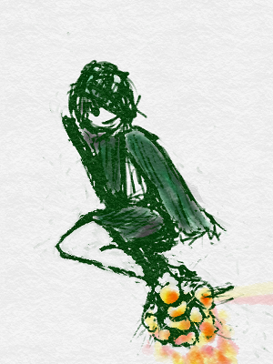

プログラマーになる<ruby>準備<rt>じゅんび</rt></ruby>はできましたね

# <ruby>簡単<rt>かんたん</rt></ruby>な、コードを<ruby>試<rt>ため</rt></ruby>してみましょう

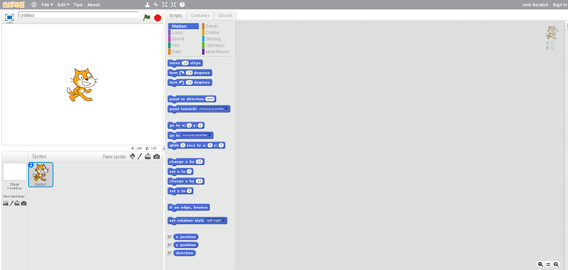

まずは、このページは<ruby>開<rt>ひら</rt></ruby>けていますか?
<ruby>開<rt>ひら</rt></ruby>けてなければ、<ruby>前回<rt>ぜんかい</rt></ruby>の<ruby>記事<rt>きじ</rt></ruby>を<ruby>参照<rt>さんしょう</rt></ruby>してください。

### <ruby>好<rt>す</rt></ruby>きなのを<ruby>選<rt>えら</rt></ruby>んでね?
Scratchでは、<ruby>画面<rt>がめん</rt></ruby>に<ruby>表示<rt>ひょうじ</rt></ruby>したキャラクターを<ruby>自由<rt>じゆう</rt></ruby>に<ruby>操作<rt>そうさ</rt></ruby>できます。
<ruby>操作<rt>そうさ</rt></ruby>してみましょう

<ruby>以下<rt>いか</rt></ruby>から<ruby>好<rt>す</rt></ruby>きなのを<ruby>選<rt>えら</rt></ruby>んで<ruby>動<rt>うご</rt></ruby>かしてみよう!!

※「Helloとしゃべらせてみる」 は<ruby>必<rt>かな</rt></ruby>ず<ruby>試<rt>ため</rt></ruby>してね!!
1. Helloとしゃべらせてみる --> 1-1に<ruby>移動<rt>いどう</rt></ruby>してください
2. <ruby>前進<rt>ぜんしん</rt></ruby>させてみる --> 2-1に<ruby>移動<rt>いどう</rt></ruby>してください
3. ニャーと<ruby>鳴<rt>な</rt></ruby>かせてみる --> 4-1に<ruby>移動<rt>いどう</rt></ruby>してください
4. ドレミと<ruby>楽器<rt>がっき</rt></ruby>を<ruby>鳴<rt>な</rt></ruby>らしてみる --> 5-1に<ruby>移動<rt>いどう</rt></ruby>してください

　
　
　
　
## [1-1] Helloとしゃべらせてみる

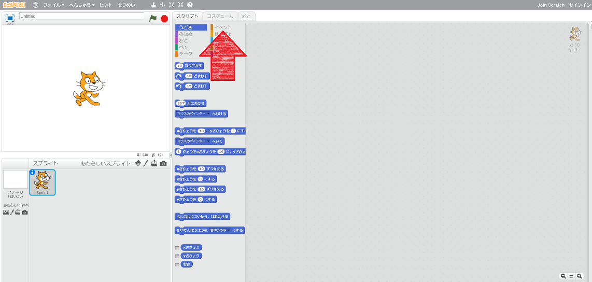

#### 1. イベントをクリックしてください。
--> すると、<ruby>以下<rt>いか</rt></ruby>のような<ruby>画面<rt>がめん</rt></ruby>に<ruby>変<rt>か</rt></ruby>わります。
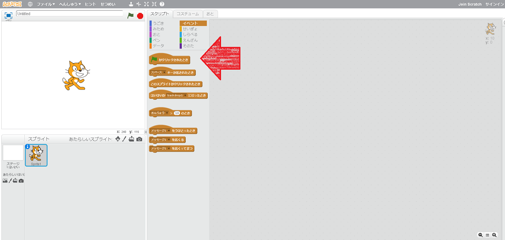

#### 2. 「<ruby>旗<rt>はた</rt></ruby>がクリックされたとき」を、<ruby>右側<rt>みぎがわ</rt></ruby>の<ruby>領域<rt>りょういき</rt></ruby>にドラッグ&ドロップ
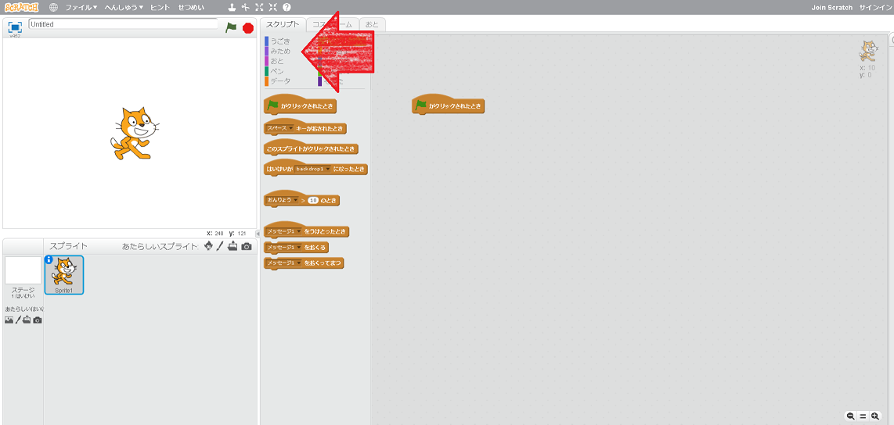

#### 3. "みため" をクリック
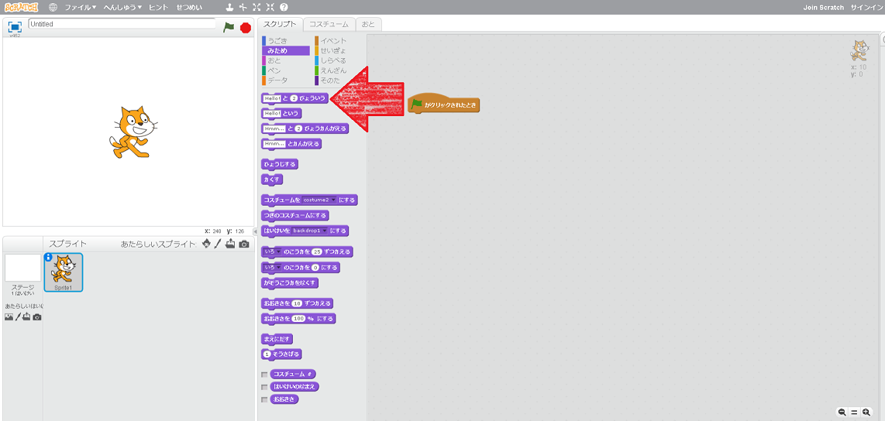

#### 4. "Helloと2びょういう"をドラック&ドロップして、"はたがクリックされたとき"につなげる
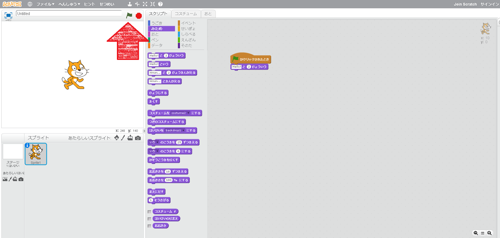

#### 5. <ruby>旗<rt>はた</rt></ruby>をクリックすると、"Helloとネコが<ruby>話<rt>はな</rt></ruby>します"
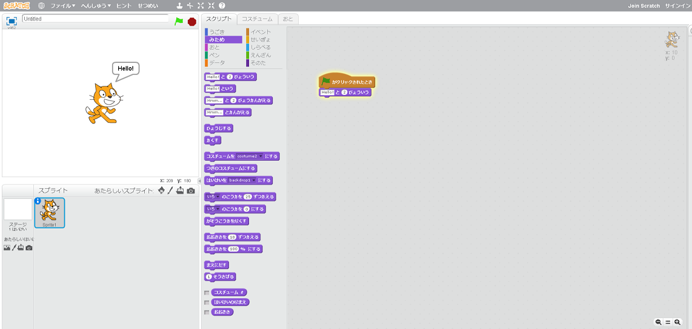

　
　
　
　
　
　
# [2-1] <ruby>前進<rt>ぜんしん</rt></ruby>させてみる

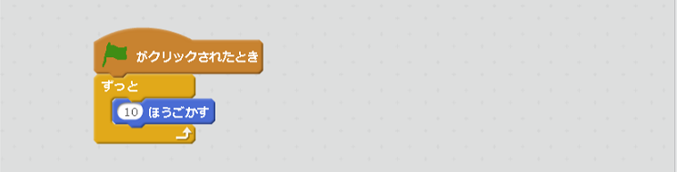

#### 1. イベントをクリック
#### 2. <ruby>旗<rt>はた</rt></ruby>がクリックされたときをドラック&ドロップ
#### 3. せいぎょをクリック
#### 4. ずっとをドラック&ドロップ
#### 5. うごきをクリック
#### 6. 10ほうごかすをドラックドロップ
#### 7. <ruby>旗<rt>はた</rt></ruby>をクリックすると、ネコが<ruby>右<rt></rt></ruby>に<ruby>移動<rt>いどう</rt></ruby>します。

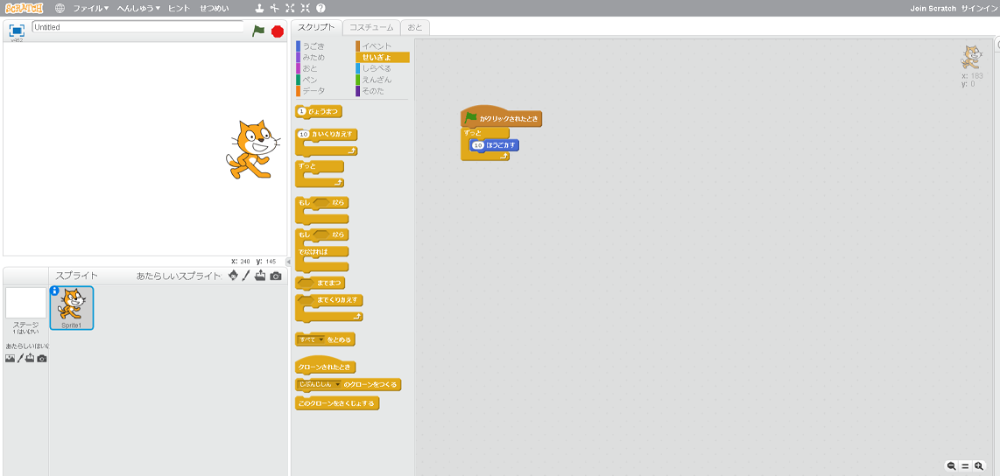

#### 8. [5-1]に<ruby>移動<rt>いどう</rt></ruby>する

# [3-1] ニャーと<ruby>泣<rt>な</rt></ruby>いてみる

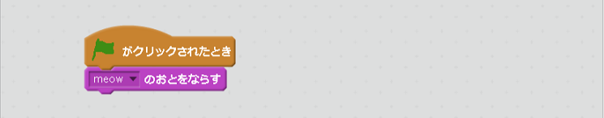

#### 1. イベントをクリック
#### 2. <ruby>旗<rt>はた</rt></ruby>がクリックされたときをドラック&ドロップ
#### 3. <ruby>音<rt>おと</rt></ruby>をクリック
#### 4. meowとおとをならすをドラック&ドロップ
#### 5. <ruby>旗<rt>はた</rt></ruby>をクリックすると、ニャーと<ruby>泣<rt>な</rt></ruby>きます

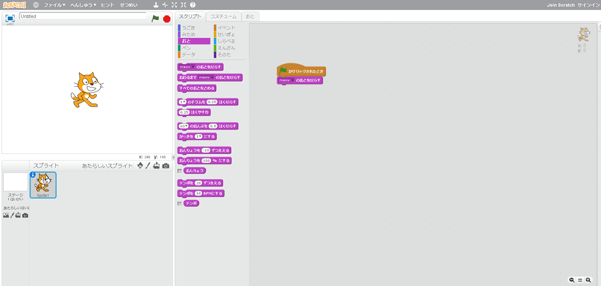

#### 6. [5-1]に<ruby>移動<rt>いどう</rt></ruby>する

　
　
　
　
　

# [4-1] ドレミと<ruby>演奏<rt>えんそう</rt></ruby>してみる
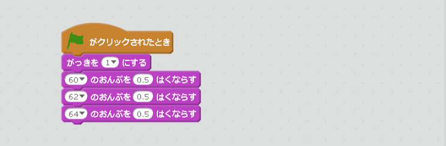

#### 1. イベントをクリック
#### 2. <ruby>旗<rt>はた</rt></ruby>がクリックされたときをドラック&ドロップ
#### 3. <ruby>音<rt>おと</rt></ruby>をクリック
#### 4. がっきを1にする
#### 5. 60のおんぷを0.5はくならす
#### 6. 60のおんぷを0.5はくならす
#### 7. 60の部分を62にかえる
#### 8. 60のおんぷを0.5はくならす
#### 9. 60の<ruby>部分<rt>ぶぶん</rt></ruby>を64にかえる
#### 10. <ruby>旗<rt>はた</rt></ruby>をクリックすると、ドレミとなります。

　
　
　
　
　
# [5-1] Good!!

どうでしょうか。<ruby>簡単<rt>かんたん</rt></ruby>な<ruby>操作<rt>そうさ</rt></ruby>をしてみました。

<ruby>物足<rt>ものた</rt></ruby>りないないですか?

うーむ、そうですね

<ruby>私<rt>わたし</rt></ruby>は、これから、
* <ruby>歩行<rt>ほこう</rt></ruby>アニメーションを<ruby>追加<rt>ついか</rt></ruby>したり
* <ruby>会話機能<rt>かいわきのう</rt></ruby>を<ruby>利用<rt>りよう</rt></ruby>して、<ruby>寸劇<rt>すんげき</rt></ruby>を<ruby>作<rt>つく</rt></ruby>ったり

してみようかなと<ruby>考<rt>かんが</rt></ruby>えています。

## Thanks

ここまで、<ruby>読<rt>よ</rt></ruby>んでくれてありがとう!!

では、<ruby>次回<rt>じかい</rt><ruby>、また
<ruby>会<rt>あ</rt></ruby>えることを、
<ruby>楽<rt>たの</rt></ruby>しみにしています。

ではでは

